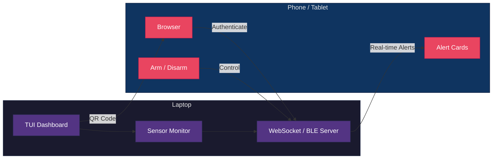
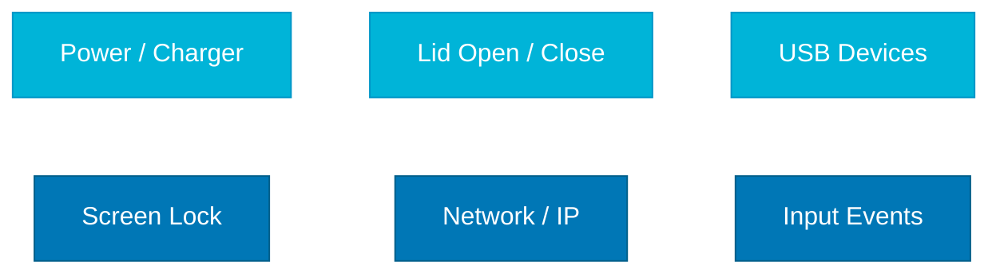
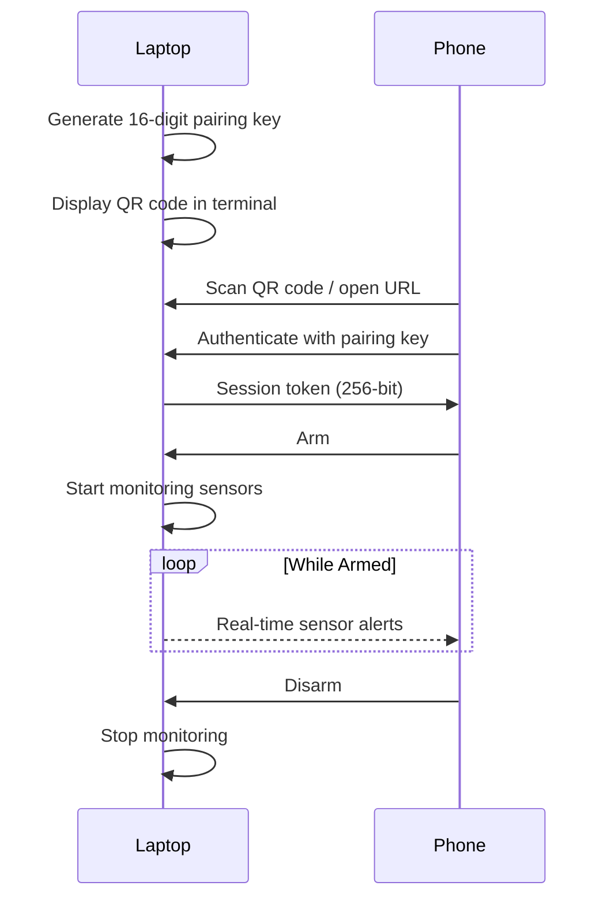

<div align="center">

# LeaveSafe

### Leave your laptop. Stay safe.

A lightweight, cross-platform device security monitor that turns your phone into a remote alarm system — no cloud, no accounts, just a QR code scan.

<br/>

[](https://github.com/atakankizilyuce/LeaveSafe/actions/workflows/ci.yml)
[](https://go.dev)
[](LICENSE)
[](#platform-support)

[](https://github.com/atakankizilyuce/LeaveSafe/actions/workflows/ci.yml)
[](https://github.com/atakankizilyuce/LeaveSafe/actions/workflows/ci.yml)
[](https://github.com/atakankizilyuce/LeaveSafe/actions/workflows/ci.yml)
[](https://github.com/atakankizilyuce/LeaveSafe/actions/workflows/ci.yml)

<br/>

**[Getting Started](#getting-started) | [Features](#features) | [How It Works](#how-it-works) | [Configuration](#configuration)**

</div>

<br/>

## What is LeaveSafe?

LeaveSafe runs on your laptop as a terminal dashboard and lets you **arm a security monitor** from your phone by scanning a QR code. Once armed, it watches the laptop's sensors (charger, lid, USB, screen lock, network, input) and sends instant alerts to your phone if anything changes while you're away.

No internet connection required. Communication is local-only over WebSocket or Bluetooth Low Energy (BLE), secured with a 16-digit Luhn-validated pairing key.

<br/>

## Features

<table>
<tr>
<td width="50%" valign="top">

### Pairing & Connection
- **QR Code Pairing** — Scan once from your phone's browser, no app required
- **Dual Transport** — Connect via Wi-Fi (WebSocket) or Bluetooth Low Energy (BLE)
- **No Cloud, No Accounts** — Everything stays on your local network

### Monitoring
- **Multi-Sensor Monitoring** — Power/charger, lid, USB, screen lock, network, and input changes
- **Auto-Arm on Screen Lock** — Optionally arm automatically when you lock your laptop
- **Sensor Pause / Disable** — Dismiss an alarm by pausing a sensor temporarily or disabling it permanently

### Alarm
- **Volume Escalation** — Configurable levels: notify phone only, medium volume, then full volume
- **Local Siren** — Alternating tone alarm sounds directly on the laptop
- **Graceful Alarm** — Triggers automatically if all clients disconnect while armed
- **PIN Protection** — Optionally require a PIN code to disarm

</td>
<td width="50%" valign="top">

### Security
- **Rate Limiting & Lockout** — 5 failed auth attempts triggers a 60-second lockout
- **Session Management** — Maximum 3 concurrent authenticated clients
- **256-bit Session Tokens** — Random hex tokens, never reused
- **Event Audit Log** — All security events recorded in JSONL format with timestamps

### Interface
- **Live TUI Dashboard** — ASCII terminal UI with QR code, live logs, and system status
- **Mobile Web UI** — Responsive, dark-themed phone interface served directly from the binary
- **Interactive Terminal Commands** — Test alerts, trigger sensors, view history, rotate keys

### Deployment
- **Cross-Platform** — Native sensor implementations for Windows, Linux, and macOS
- **Single Binary** — No dependencies, just download and run
- **Docker Support** — Run in a container with privileged hardware access
- **Configuration Persistence** — Settings saved in JSON format across sessions

</td>
</tr>
</table>

<br/>

## How It Works



<br/>

<div align="center">

### Sensors



</div>

<br/>

### Pairing Flow



<br/>

## Getting Started

### Download Binary

Grab the latest pre-built binary from the [Releases page](https://github.com/atakankizilyuce/LeaveSafe/releases).

| Platform | File |
|----------|------|
| Windows 64-bit | `leavesafe-windows-amd64.exe` |
| Linux 64-bit | `leavesafe-linux-amd64` |
| macOS Intel | `leavesafe-darwin-amd64` |
| macOS Apple Silicon | `leavesafe-darwin-arm64` |

#### macOS: First-time setup

macOS blocks unsigned binaries by default. After downloading, run these commands in Terminal to make it executable:

```bash
# 1. Grant execute permission
chmod +x leavesafe-darwin-arm64

# 2. Remove the quarantine attribute added by macOS Gatekeeper
xattr -d com.apple.quarantine leavesafe-darwin-arm64

# 3. Run it
./leavesafe-darwin-arm64
```

> **Note:** Replace `leavesafe-darwin-arm64` with `leavesafe-darwin-amd64` if you are on an Intel Mac.

If you still see a "cannot be opened" warning, go to **System Settings > Privacy & Security** and click **Open Anyway** next to the LeaveSafe entry.

### Build from Source

```bash
# Requires Go 1.25+
git clone https://github.com/atakankizilyuce/LeaveSafe.git
cd LeaveSafe

# Build for your current platform
go build -o leavesafe ./cmd/leavesafe

# Or use the Makefile to build all platforms
make all
```

### Docker

```bash
docker-compose up
```

> **Note:** The container runs with `privileged: true` and mounts `/sys` and `/proc` for full sensor access on Linux.

<br/>

## Usage

```bash
./leavesafe          # normal mode
./leavesafe -dev     # development mode (serves web assets from filesystem)
```

The terminal dashboard opens with:
- A **QR code** on the left — scan it with your phone
- A **status panel** on the right showing armed state, connected clients, active sensors, and the pairing key
- A **live log** area at the bottom

### Terminal Commands

| Command | Description |
|---------|-------------|
| `test` | Send a test alert to all connected clients |
| `trigger <sensor>` | Manually trigger a specific sensor (`power`, `lid`, `usb`, `screen`, `network`, `input`) |
| `stop` / `silence` | Stop an active alarm |
| `history` | Show the last 20 security events |
| `rotate-key` | Generate a new pairing key and invalidate all sessions |
| `help` | Show available commands |
| `Ctrl+C` | Graceful shutdown |

**On your phone:** Open the URL shown in the terminal (or scan the QR code), authenticate, and use the **Arm** / **Disarm** buttons. You can also enable/disable individual sensors and configure alarm settings from the phone UI.

<br/>

## Platform Support

| Feature | Windows | Linux | macOS |
|---------|:-------:|:-----:|:-----:|
| Power / Charger | ✅ | ✅ | ✅ |
| Lid open / close | ✅ | ✅ | ✅ |
| USB connect / disconnect | ✅ | ✅ | ✅ |
| Screen lock / unlock | ✅ | ✅ | ✅ |
| Network / IP change | ✅ | ✅ | ✅ |
| Input (keyboard/mouse) | ✅ | ✅ | ✅ |
| Bluetooth Low Energy | ✅ | ✅ | ✅ |
| Local alarm siren | ✅ | ✅ | ✅ |

<br/>

## Configuration

Settings are stored in a JSON file and persist across sessions:

| OS | Path |
|----|------|
| Windows | `%APPDATA%\LeaveSafe\config.json` |
| Linux / macOS | `~/.leavesafe/config.json` |

You can change settings from the phone UI or by editing the file directly.

<details>
<summary><b>All configuration options</b></summary>

<br/>

| Setting | Default | Description |
|---------|---------|-------------|
| `port` | `0` (auto) | HTTP server port |
| `max_sessions` | `3` | Maximum concurrent clients |
| `max_auth_attempts` | `5` | Failed attempts before lockout |
| `lockout_seconds` | `60` | Lockout duration |
| `heartbeat_seconds` | `15` | Status broadcast interval |
| `disconnect_grace_seconds` | `30` | Delay before alarm on full disconnect |
| `auto_arm_on_lock` | `false` | Arm automatically when screen locks |
| `connection_mode` | `wifi` | Transport mode (`wifi` or `bluetooth`) |
| `pin_protection.enabled` | `false` | Require PIN to disarm |
| `alarm.escalation_enabled` | `false` | Enable volume escalation levels |
| `enabled_sensors.*` | varies | Toggle individual sensors on/off |

</details>

<br/>

## Security Model

| Layer | Detail |
|-------|--------|
| **Pairing Key** | 16 digits with Luhn check digit, generated fresh each run |
| **Session Tokens** | 256-bit random hex strings, never reused |
| **Rate Limiting** | 60-second lockout after 5 failed auth attempts |
| **Session Limit** | Maximum 3 concurrent connections |
| **Disconnect Alarm** | Triggers after 30-second grace period if all clients drop while armed |
| **Local-Only** | No data ever leaves your LAN |

<br/>

## Contributing

Contributions are welcome. Please open an issue first to discuss what you'd like to change.

1. Fork the repository
2. Create a feature branch (`git checkout -b feature/my-feature`)
3. Commit your changes
4. Open a Pull Request

Run tests before submitting:

```bash
go test ./... -v -race
```

<br/>

<div align="center">

## License

Distributed under the [Apache License 2.0](LICENSE).

<br/>

Made with Go

</div>
