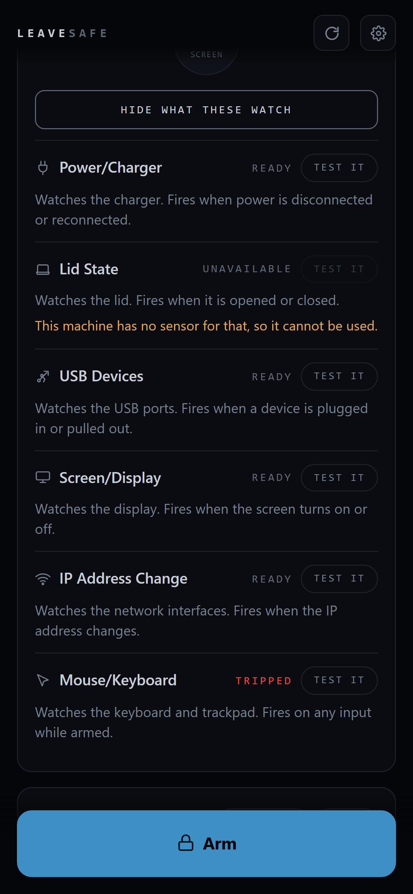
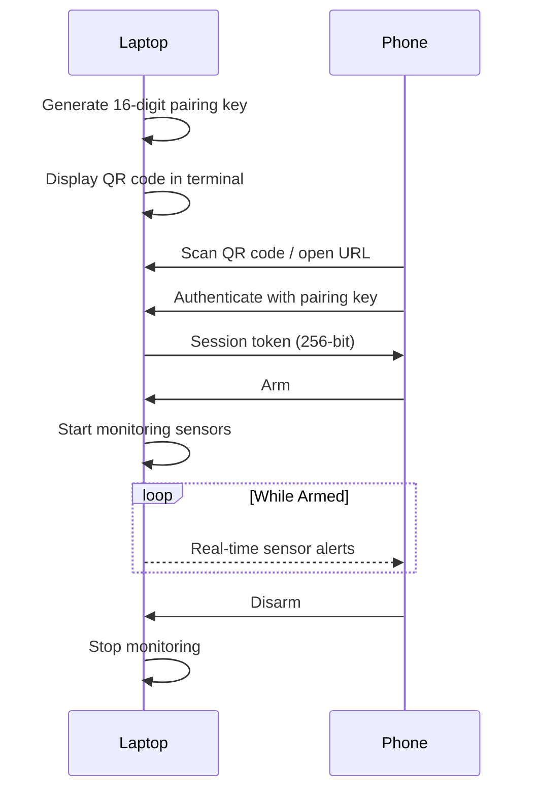

<div align="center">


# LeaveSafe

### Leave your laptop. Stay safe.

**A cross-platform device security monitor that turns your phone into a remote alarm for your laptop.**<br/>
Run it, scan the QR code, tap *Arm*, and walk away. The moment anyone touches your machine, your phone goes off in your pocket — and the laptop starts screaming too.

<br/>

[](https://github.com/atakankizilyuce/LeaveSafe/actions/workflows/ci.yml)
[](https://github.com/atakankizilyuce/LeaveSafe/security/code-scanning)
[](https://sonarcloud.io/summary/new_code?id=atakankizilyuce_LeaveSafe)
[](https://sonarcloud.io/component_measures?id=atakankizilyuce_LeaveSafe&metric=coverage)
[](https://go.dev)
[](LICENSE)
[](#platform-support)

<br/>

**[Demo](#demo) · [Features](#features) · [Installation](#installation) · [Quick start](#quick-start) · [Usage](#usage) · [How it works](#how-it-works) · [Security](#security) · [Docs](#documentation)**

</div>

<br/>

Sometimes you have to leave your laptop on the table — the counter, the bathroom, a phone call outside. LeaveSafe watches it while you are gone: the charger, the lid, the USB ports, the screen, the network and the input devices. If any of them changes, you know within a second.

No account. No server. No internet needed. Your phone talks straight to your laptop over your local network or Bluetooth, and the 16-digit pairing key never leaves the two of them.

> The phone is the convenience, not the alarm. It has to be on the same network with the page open: when its screen locks, the operating system freezes the page, so an alert may not reach it until you open it again — and off that network it hears nothing at all. The laptop sounds regardless.

<br/>

## Demo

<div align="center">


<br/>

**Tap arm → three seconds → the sensors gather into a shield → someone touches the laptop → your phone knows.**

<sub>Recorded from one real session. The alert is a genuine input-sensor event read from the operating system, not a mock-up.</sub>

</div>

<details>
<summary><b>How every picture on this page was made</b></summary>

<br/>

| File | What it is |
|------|------------|
| `hero.svg`, `flow.svg` | Hand-written animated SVGs (SMIL, no scripts, no external fetches) |
| `tui-*.png` | The real terminal dashboard, captured from a running binary |
| `phone-*.png` | The real phone interface, captured in a mobile viewport |
| `demo.gif` | One whole run — pair, arm, alert, dismiss, disarm — recorded from a single session |

**The screenshots are of the real program**, not mock-ups and not staged. The binary was started with a throwaway config directory, a headless mobile browser paired with it over the actual WebSocket protocol, and every state was reached by driving the interface the way a person would: tapping *Arm*, waiting the countdown out, dismissing the alert, holding to disarm.

**The alert is a real sensor event.** The input sensor reads `GetLastInputInfo`, which only moves when the operating system's input queue sees genuine keyboard or pointer activity — no event a browser can raise reaches it. The pointer was moved by an injected `SendInput` call rather than by hand, which is the same path a mouse's own movement takes and the only one the sensor can see; everything after that is the product doing its job. The machine really was armed, the sensor really fired, and the alert really travelled to the phone over the wire. Nothing was pushed at the phone to make a picture.

**How `demo.gif` was recorded.** Frames come from Chrome DevTools' screencast, which stamps every frame the compositor produces, and the timeline is rebuilt from those stamps at an exact twenty frames a second. A screenshot loop was what the earlier recording used, and its period wandered.

The viewport is fixed and nothing is captured full-page. The panel's height changes with its state, so a full-page capture returns a different picture size on almost every frame; pasting those into one canvas is what made the earlier recording drift.

One palette, built by median cut across every frame, is shared by all of them, so a colour cannot shift between frames. Each frame after the first is stored as the bounding box of the pixels whose palette index changed — which is only safe because that box is measured on the quantised frames themselves, so nothing that changed can fall outside it.

Three stretches are cut: the panel sitting still between pairing and the tap on *Arm*, the five seconds the input sensor spends in its arming grace period, and part of the pause while the alert waits to be dismissed. Nothing happens in any of them, and each cut joins two frames of the same state. Every transition in the recording is played at the speed it happened.

**Nothing was faked to fill the panel.** The machine these were taken on has no lid sensor, so LID reports itself unavailable — which is why the shots show five sensors inside the shield and LID standing outside it with `no sensor on this machine` written underneath. That is the panel doing its job, and it is worth more in a README than a machine with a full set would have been.

The terminal shots are the binary's own output. It writes a cursor-addressed ANSI screen; that stream was replayed through a terminal emulator to rebuild the frame exactly as a terminal draws it, then drawn as a window. The colours are a terminal theme rather than the product's palette — what the binary emits is the sixteen colours every console has had since the 1980s, and which shade of cyan a terminal draws for colour 36 is the terminal's business.

The pairing keys and the local address visible in the screenshots are per-run values from a throwaway session. A new key is generated every time LeaveSafe starts.

</details>

<br/>

## Features

- **QR code pairing** — no app to install; the phone opens a page served by your own laptop
- **Six sensors** — power, lid, USB, screen, network and input, each switchable and self-testable from the phone
- **Tap to arm, hold to disarm** — disarming asks for a second and a half of deliberate intent
- **A local siren with volume escalation**, so the laptop sounds whether or not your phone is awake
- **Disconnect alarm** if every phone drops off while armed, plus an optional scrypt-hashed disarm PIN
- **Wi-Fi everywhere, Bluetooth Low Energy on macOS**
- **Optional [location](docs/location.md)** — off by default, switchable while it runs
- **[Starts when you log in](docs/service.md)**, survives a panicking sensor, and reports the gap after a crash
- **An audit log** of every security event, and **signed provenance** on every release artifact

<br/>

## Installation

### Package managers

Recommended — this puts `leavesafe` on your `PATH` and makes upgrading one command:

```bash
# macOS / Linux — Homebrew
brew tap atakankizilyuce/tap && brew install leavesafe

# Windows — WinGet
winget install LeaveSafe.LeaveSafe

# Windows — Scoop
scoop bucket add atakankizilyuce https://github.com/atakankizilyuce/homebrew-tap
scoop install leavesafe
```

### Binaries

Download from the [Releases page](https://github.com/atakankizilyuce/LeaveSafe/releases). One file, no installer, no dependencies.

| Platform | File |
|---|---|
| Windows (x64) | `leavesafe-windows-amd64.exe` |
| Linux (x64 / ARM64) | `leavesafe-linux-amd64` · `leavesafe-linux-arm64` |
| macOS (Intel / Apple silicon) | `leavesafe-darwin-amd64` · `leavesafe-darwin-arm64` |

On Linux and macOS, `chmod +x` the file before running it.

However you install it, LeaveSafe tells you when a newer release exists and names the command that upgrades *your* installation. Nothing is downloaded or replaced without you.

<details>
<summary><b>macOS says the developer cannot be verified</b></summary>

<br/>

This release was published without a signing certificate. Open **System Settings → Privacy & Security** and click **Open Anyway** next to the LeaveSafe entry.

Installing with `brew` does not raise the prompt at all. Gatekeeper checks files carrying the quarantine attribute, which a browser attaches to a download and Homebrew's formula path does not. That is a difference in how the file reached you, not in how much it deserves your trust — so verify the provenance either way.

Older instructions told you to run `xattr -d com.apple.quarantine`. Do not — and be wary of any security tool that tells you to. That command disarms exactly the check that would catch a tampered download. Verify the provenance instead.

</details>

<details>
<summary><b>Windows warns about the file, or Defender takes it away</b></summary>

<br/>

This release was published without a signing certificate, so SmartScreen warns the first time it runs: **More info → Run anyway**.

Defender may go further and quarantine the download, usually naming it `Trojan:Win32/Bearfoos.B!ml`. The `!ml` on the end is the part worth reading: it means a machine-learning model guessed, rather than a signature matching something known. Those models guess this way about executables that are unsigned, carry no publisher, and have been downloaded by almost nobody yet — whatever language they were written in. [A Go build tool](https://github.com/go-task/task/issues/210), [a Rust one](https://github.com/openai/codex/issues/3207) and [a Microsoft project](https://github.com/microsoft/apm/issues/487) have all been flagged by the same family.

That explanation is not proof, and it is not meant to be taken on trust. Verify the provenance below instead: the attestation says which workflow, at which commit, produced the exact file on your disk — a narrower and more checkable claim than any antivirus verdict in either direction. If it does not verify, the file did not come from here, and no amount of explanation should persuade you to run it.

If it does verify and Defender still objects, [Microsoft's submission portal](https://www.microsoft.com/en-us/wdsi/filesubmission) is where the false positive gets corrected. That is worth doing rather than adding an exclusion: a corrected model reaches everyone, while an exclusion is a hole in one machine's defences that outlives the reason it was made.

</details>

<details>
<summary><b>Verifying a download</b></summary>

<br/>

Every release artifact carries a signed attestation naming the workflow and the commit that produced it. That is a stronger claim than a checksum, which only proves a file matches a number published beside it by whoever published both:

```bash
gh attestation verify leavesafe-linux-amd64 --repo atakankizilyuce/LeaveSafe
shasum -a 256 -c leavesafe-linux-amd64.sha256        # a .sha256 ships beside each file too
```

On Windows the file is `leavesafe-windows-amd64.exe`, `gh attestation verify` takes the same form, and `Get-FileHash` stands in for `shasum`.

A [CycloneDX SBOM](https://cyclonedx.org/) listing every dependency is attached to each release, so you can check what is inside the binary against a vulnerability database without building it yourself.

</details>

<br/>

## Quick start

### 1. Run it

Double-click it, or run it from a terminal. The dashboard takes over the window: a QR code on the left, live status on the right, the log along the bottom.

<div align="center">

</div>

### 2. Scan it with your phone

Point your camera at the QR code and open the link. There is no app to install — it is a web page served by your own laptop, and the scan fills the pairing key in for you.

### 3. Arm it, and walk away

Tap **Arm**. The page climbs towards armed for three seconds, the sensors gather into a shield, and your laptop is being watched.

<table>
<tr>
<td width="34%" align="center">

<br/><sub><b>Scanned.</b> The key arrives pre-filled. Typing the 16 digits by hand works too.</sub>
</td>
<td width="33%" align="center">

<br/><sub><b>Arming.</b> Three seconds, and the page climbs a third of the way with each one.</sub>
</td>
<td width="33%" align="center">

<br/><sub><b>Armed.</b> Every sensor covering you is inside the shield; the rest stand below it with a reason each.</sub>
</td>
</tr>
</table>

<br/>

## Usage

### On your phone

<table>
<tr>
<td width="34%" align="center">

<br/><sub><b>Standby.</b> A shut eye, and the sensors standing apart. Nothing is being watched yet.</sub>
</td>
<td width="33%" align="center">

<br/><sub><b>Something happened.</b> Dismiss it, pause that sensor, or switch it off.</sub>
</td>
<td width="33%" align="center">

<br/><sub><b>Disarmed.</b> The station that fired stays red, so you can see what it was.</sub>
</td>
</tr>
</table>

Tap any station to turn that sensor on or off. Arming pulls every sensor that is actually covering you into a shield in the middle; the rest travel the other way, each with a stated reason.

<table>
<tr>
<td width="34%" align="center">

<br/><sub><b>What these watch</b> — one disclosure under the ring, with a self-test for each sensor.</sub>
</td>
<td width="33%" align="center">

<br/><sub><b>Settings</b> — transport, session limits, lockout, PIN.</sub>
</td>
<td width="33%" align="center">

<br/><sub><b>Location</b> — off by default, and it tells you what each source costs.</sub>
</td>
</tr>
</table>

### On your laptop

The terminal dashboard keeps the QR code, live status and the log on one screen. While armed, the state block turns red and every sensor event is written as it happens.

<div align="center">

</div>

Type any of these into the dashboard while it runs:

| Command | What it does |
|---------|--------------|
| `test` | Send a test alert to every connected phone |
| `trigger <sensor>` | Fire one sensor by hand (`power`, `lid`, `usb`, `screen`, `network`, `input`) |
| `arm` / `disarm` | Arm or disarm from the terminal; disarm asks for the PIN if one is set |
| `status` | Armed state, how long for, phones connected and every sensor |
| `stop` / `silence` | Stop an alarm that is going off, on the laptop and on every paired phone |
| `history` | The last 20 security events |
| `urls` · `qr <n>` | Every address the server is reachable on, and the QR code for one of them |
| `lang` | Change the language the startup questions are asked in |
| `update` | Ask GitHub now whether a newer release exists, and say either way |
| `rotate-key` | New pairing key, all sessions invalidated |
| `help` · `Ctrl+C` | The list above; graceful shutdown |

The dashboard draws on the alternate screen, so the window you started it in is
handed back exactly as you left it — scrollback and all — when you quit or press
Ctrl+Z. If you would rather not have a full-screen dashboard at all, `-plain`
prints the QR code once and then logs; the commands above still work. It is
chosen for you when output is redirected to a file or a pipe.

Settings persist in a config file between runs — [Configuration](docs/configuration.md) lists every option.

<br/>

## How it works

<div align="center">

</div>

The binary runs three things at once: the sensor monitor that reads the operating system, a WebSocket (and optionally Bluetooth) server your phone connects to, and the terminal dashboard. Nothing else is involved — no broker, no relay, no account, no telemetry.

### The sensors

| Sensor | What trips it |
|--------|---------------|
| **Power** | The charger is unplugged or plugged in |
| **Lid** | The lid is closed or opened |
| **USB** | A USB device appears or disappears |
| **Screen** | The display turns off or comes back on — what happens when the machine locks |
| **Network** | An interface or its IP address changes |
| **Input** | Sustained keyboard or mouse activity |

Each is implemented natively per platform — `/sys` and `/proc` on Linux, Win32 and PowerShell on Windows, `pmset`, `ioreg` and `system_profiler` on macOS. A sensor that cannot work on your machine reports itself unavailable rather than silently never firing.

### Platform support

| Feature | Windows | Linux | macOS |
|---------|:-------:|:-----:|:-----:|
| Power · Lid · USB · Screen · Network · Input | ✅ | ✅ | ✅ |
| Local alarm siren | ✅ | ✅ | ✅ |
| Wi-Fi positioning | ✅ | ✅ | ❌ |
| Bluetooth Low Energy | ❌ | ❌ | ✅ |

Bluetooth pairing runs on macOS only: the Windows and Linux stacks do not tell the application *which* device sent a message, and a pairing that cannot be kept to one phone would authenticate every device in radio range. Wi-Fi pairing — what the QR code uses — works on all three.

<details>
<summary><b>The pairing handshake, step by step</b></summary>

<br/>


```mermaid
sequenceDiagram
    participant L as Laptop
    participant P as Phone

    L->>L: Generate 16-digit pairing key
    L->>L: Display QR code in terminal
    P->>L: Scan QR code / open URL
    P->>L: Authenticate with pairing key
    L->>P: Session token (256-bit)
    P->>L: Arm
    L->>L: Start monitoring sensors

    loop While Armed
        L-->>P: Real-time sensor alerts
    end

    P->>L: Disarm
    L->>L: Stop monitoring
```

</details>

<br/>

## Security

| Layer | Default |
|-------|---------|
| **Pairing key** | 16 digits with a Luhn check digit, generated fresh each run, so a mistyped digit never counts as a failed attempt |
| **Session tokens** | 256-bit random hex, never reused, expiring after 24 hours or 8 hours idle |
| **Rate limiting** | 60-second lockout after 5 failed attempts, counted **per source address** so a stranger cannot lock you out |
| **Session limit** | 3 concurrent connections |
| **Disarm PIN** | Optional, hashed with scrypt, against the same lockout as the pairing key |
| **Transport** | Local network only, over plain HTTP. Nothing is published beyond your network and nothing is asked of your router |

All of these are configurable; the defaults are shown. Nothing is uploaded anywhere — the phone talks directly to your laptop.

[`SECURITY.md`](SECURITY.md) sets out what is in scope, what is deliberately not, and how to report a flaw privately. **Read the section on what pairing does and does not prove**: the connection carries no certificate, so a phone cannot tell which machine answered before it sends the key.

<br/>

## Documentation

| | |
|---|---|
| [Configuration](docs/configuration.md) | Where settings live and every option there is |
| [Location](docs/location.md) | How the machine's position is worked out, and why it is off by default |
| [Starting at login](docs/service.md) | `install-service`, and what happens after a crash or a reboot |
| [Development](docs/development.md) | Building, the phone interface, the checks, and what CI actually proves |
| [Manual verification](docs/manual-verification.md) | The hardware checklist no CI runner can cover |
| [Releasing](docs/releasing.md) | The order to cut a release in |
| [Code signing policy](docs/code-signing-policy.md) | Who can sign a release, what the signature proves, what leaves your machine, and how to remove it |

<br/>

## Contributing

Contributions are welcome. Please open an issue first to discuss what you'd like to change.

```bash
go test ./... -race     # the fast loop
make check              # what CI runs: format, vet, lint, frontend, vulncheck, tests
```

Two things CI will catch that are easy to forget: if you changed anything under `web/src`, run `npm run build` in `web/` and commit `web/dist` — the binary embeds it, so a stale build ships a UI that does not match its source. And if you changed something a user would notice, add a line to [`CHANGELOG.md`](CHANGELOG.md) under Unreleased.

**Found a security flaw?** Do not open an issue. [`SECURITY.md`](SECURITY.md) has the private reporting route.

Taking part here means keeping to the [Code of Conduct](CODE_OF_CONDUCT.md).

<br/>

<div align="center">

## License

Distributed under the [Apache License 2.0](LICENSE).

<br/>

Made with Go

</div>
