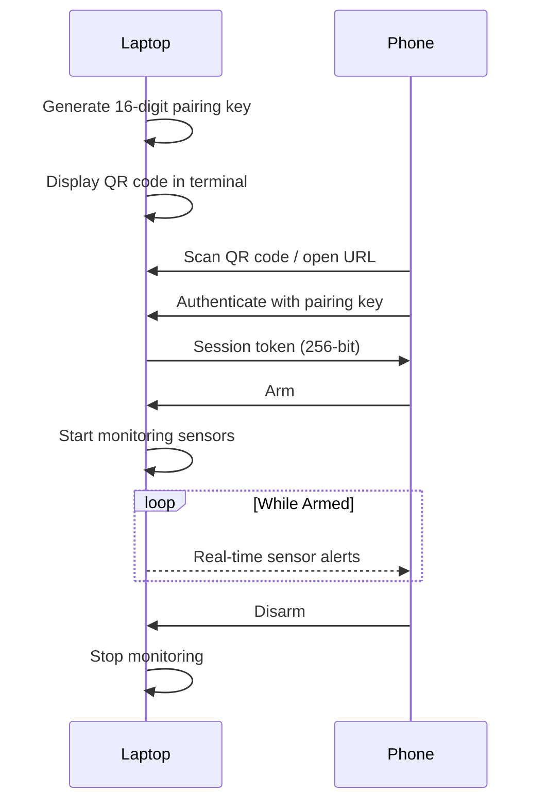

<div align="center">


# LeaveSafe

### Leave your laptop. Stay safe.

A cross-platform device security monitor that turns your phone into a remote alarm for your laptop — no cloud, no accounts, one QR scan.

<br/>

[](https://github.com/atakankizilyuce/LeaveSafe/actions/workflows/ci.yml)
[](https://github.com/atakankizilyuce/LeaveSafe/security/code-scanning)
[](https://sonarcloud.io/summary/new_code?id=atakankizilyuce_LeaveSafe)
[](https://sonarcloud.io/component_measures?id=atakankizilyuce_LeaveSafe&metric=coverage)
[](https://go.dev)
[](LICENSE)
[](#platform-support)

<br/>

**[See it work](#see-it-work) · [Set it up](#set-it-up) · [The interface](#the-interface) · [How it works](#how-it-works) · [Security](#security)**

</div>

<br/>

## The problem

You are in a café, a library, a co-working space. You need to stand up — the counter, the bathroom, a phone call outside. Your laptop is on the table. You either carry it with you every single time, or you leave it and hope.

**LeaveSafe is the third option.** Run it, scan the QR code with your phone, tap *Arm*, and walk away. The laptop watches its own charger, lid, USB ports, screen lock, network and input. The moment any of them changes, your phone goes off in your pocket — and the laptop starts screaming too.

The phone is the convenience, not the alarm: when its screen locks, the operating system freezes the page, so an alert may not reach it until you open it again. The laptop sounds regardless.

No account. No server. No internet needed. Your phone talks straight to your laptop over your local network or Bluetooth, and the 16-digit pairing key never leaves the two of them.

<br/>

## See it work

<div align="center">


<br/>

**Tap arm → the page climbs towards armed for three seconds → the sensors gather into a shield → someone touches the laptop → your phone knows.**

*Recorded from one real session. The alert is a genuine input-sensor event read from the operating system, not a mock-up — see [docs/assets](docs/assets/README.md).*

</div>

<br/>

## Set it up

### 1 · Download it

Use a package manager if you have one — it puts `leavesafe` on your `PATH` and makes upgrading one command:

```bash
brew tap atakankizilyuce/tap && brew install leavesafe          # macOS / Linux
scoop bucket add atakankizilyuce https://github.com/atakankizilyuce/homebrew-tap && scoop install leavesafe
winget install LeaveSafe.LeaveSafe                              # Windows
```

Or grab the binary for your machine from the [Releases page](https://github.com/atakankizilyuce/LeaveSafe/releases): `leavesafe-windows-amd64.exe`, `leavesafe-linux-amd64`, `leavesafe-linux-arm64`, `leavesafe-darwin-amd64`, `leavesafe-darwin-arm64`. One file, no installer, no dependencies. On Linux and macOS, `chmod +x` it first.

However you install it, LeaveSafe tells you when a newer release exists — and names the command that upgrades *your* installation. Nothing is ever downloaded or replaced without you.

<details>
<summary><b>macOS says the developer cannot be verified</b></summary>

<br/>

This release was published without a signing certificate. Open **System Settings → Privacy & Security** and click **Open Anyway** next to the LeaveSafe entry.

Older instructions told you to run `xattr -d com.apple.quarantine`. Do not — and be wary of any security tool that tells you to. That command disarms exactly the check that would catch a tampered download. Verify the provenance instead.

</details>

<details>
<summary><b>Verifying a download</b></summary>

<br/>

Every release artifact carries a signed attestation naming the workflow and the commit that produced it. That is a stronger claim than a checksum, which only proves a file matches a number published beside it by whoever published both:

```bash
gh attestation verify leavesafe-linux-amd64 --repo atakankizilyuce/LeaveSafe
shasum -a 256 -c leavesafe-linux-amd64.sha256        # a .sha256 ships beside each file too
```

A [CycloneDX SBOM](https://cyclonedx.org/) listing every dependency is attached to each release, so you can check what is inside the binary against a vulnerability database without building it yourself.

</details>

<br/>

### 2 · Run it

Double-click it, or run it from a terminal. The dashboard takes over the window: a QR code on the left, live status on the right, the log along the bottom.

<div align="center">

</div>

> **First run only:** LeaveSafe asks whether you want [remote access](docs/remote-access.md). If you are not sure, answer no — you can turn it on later from the phone, and local pairing works either way.

<br/>

### 3 · Scan it, arm it, walk away

Point your phone's camera at the QR code and open the link. No app to install — it is a web page served by your own laptop, and the scan fills the pairing key in for you.

<table>
<tr>
<td width="34%" align="center">

<br/><sub><b>Scanned.</b> The key arrives pre-filled. Typing the 16 digits by hand works too.</sub>
</td>
<td width="33%" align="center">

<br/><sub><b>Paired.</b> A shut eye, and the sensors standing apart. Nothing is being watched yet.</sub>
</td>
<td width="33%" align="center">

<br/><sub><b>Arming.</b> Three seconds, and the page climbs a third of the way with each one.</sub>
</td>
</tr>
</table>

**Arming is a tap; disarming is a hold.** Arming by accident costs you nothing — you are standing right there. Disarming by accident silently turns off the thing guarding your laptop, so it asks for a second and a half of deliberate intent.

<table>
<tr>
<td width="34%" align="center">

<br/><sub><b>Armed.</b> Every sensor that is covering you is inside the shield. The ones that are not stand below it, each with the reason why.</sub>
</td>
<td width="33%" align="center">

<br/><sub><b>Something happened.</b> Dismiss it, pause that sensor, or switch it off.</sub>
</td>
<td width="33%" align="center">

<br/><sub><b>Disarmed.</b> The station that fired stays red, so you can see what it was.</sub>
</td>
</tr>
</table>

<br/>

## The interface

### On your phone

**Armed is not red.** Being covered is good news, and painting it red would tell you something has gone wrong at the exact moment nothing has — and spend the alarm colour on a state that is not an alarm. So standby is an almost colourless near-black, armed is a calm blue, and red appears on exactly two surfaces in the whole product: the alert, and the one sensor that fired. Blue rather than green, because green and red are the pair one man in twelve cannot tell apart.

Tap any station to turn that sensor on or off. Arming pulls every sensor that is actually covering you into the middle, and the ring closes into a shield around them; the rest travel the other way, into a region of their own with a stated reason each.

<table>
<tr>
<td width="34%" align="center">

<br/><sub><b>What these watch</b> — one disclosure under the ring, with a self-test for each sensor.</sub>
</td>
<td width="33%" align="center">

<br/><sub><b>Settings</b> — transport, remote access, session limits, lockout, PIN.</sub>
</td>
<td width="33%" align="center">

<br/><sub><b>Location</b> — off by default, and it tells you what each source costs.</sub>
</td>
</tr>
</table>

### On your laptop

The terminal dashboard keeps the QR code, live status and the log on one screen. While armed, the state block turns red and every sensor event is written as it happens.

<div align="center">

</div>

Type any of these into the dashboard while it runs:

| Command | What it does |
|---------|--------------|
| `test` | Send a test alert to every connected phone |
| `trigger <sensor>` | Fire one sensor by hand (`power`, `lid`, `usb`, `screen`, `network`, `input`) |
| `arm` / `disarm` | Arm or disarm from the terminal; disarm asks for the PIN if one is set |
| `status` | Armed state, how long for, phones connected and every sensor |
| `stop` / `silence` | Stop an alarm that is going off, on the laptop and on every paired phone |
| `history` | The last 20 security events |
| `urls` · `qr <n>` | Every address the server is reachable on, and the QR code for one of them |
| `cert` | Print the TLS fingerprint, to compare against your phone's warning |
| `mode` · `lang` | Switch Wi-Fi / remote access without restarting; change the startup language |
| `update` | Ask GitHub now whether a newer release exists, and say either way |
| `rotate-key` | New pairing key, all sessions invalidated |
| `help` · `Ctrl+C` | The list above; graceful shutdown |

<br/>

## How it works

<div align="center">

</div>

The binary runs three things at once: the sensor monitor that reads the operating system, a WebSocket (and optionally Bluetooth) server your phone connects to, and the terminal dashboard. Nothing else is involved — no broker, no relay, no account, no telemetry.

| Sensor | What trips it |
|--------|---------------|
| **Power** | The charger is unplugged or plugged in |
| **Lid** | The lid is closed or opened |
| **USB** | A USB device appears or disappears |
| **Screen** | The display turns off or comes back on — what happens when the machine locks |
| **Network** | An interface or its IP address changes |
| **Input** | Sustained keyboard or mouse activity |

Each one is implemented natively per platform — `/sys` and `/proc` on Linux, Win32 calls and PowerShell on Windows, `pmset`, `ioreg` and `system_profiler` on macOS. A sensor that cannot work on your machine reports itself unavailable instead of silently never firing, and a sensor whose driver fails reads `fault` rather than `ready`.

<details>
<summary><b>The pairing handshake, step by step</b></summary>

<br/>


```mermaid
sequenceDiagram
    participant L as Laptop
    participant P as Phone

    L->>L: Generate 16-digit pairing key
    L->>L: Display QR code in terminal
    P->>L: Scan QR code / open URL
    P->>L: Authenticate with pairing key
    L->>P: Session token (256-bit)
    P->>L: Arm
    L->>L: Start monitoring sensors

    loop While Armed
        L-->>P: Real-time sensor alerts
    end

    P->>L: Disarm
    L->>L: Stop monitoring
```

The pairing key is generated fresh on every run and carries a Luhn check digit, so a mistyped digit is rejected before it counts as a failed attempt. Five genuinely wrong keys from the same address trigger a 60-second lockout — counted per source, so a stranger cannot lock you out of your own laptop.

</details>

<br/>

## Features

- **QR code pairing** over Wi-Fi everywhere, or Bluetooth Low Energy on macOS — no app, no account
- **Six sensors**, each switchable, pausable and self-testable from the phone
- **A local siren with volume escalation**, so the laptop sounds whether or not your phone is awake
- **Disconnect alarm** if every phone drops off while armed, and an optional scrypt-hashed disarm PIN
- **Optional [remote access](docs/remote-access.md) and [location](docs/location.md)** — both off by default, both switchable while it runs
- **[Starts when you log in](docs/service.md)**, survives a panicking sensor, and reports the gap after a crash
- **An audit log** of every security event, and **signed provenance** on every release artifact

<br/>

## Platform support

| Feature | Windows | Linux | macOS |
|---------|:-------:|:-----:|:-----:|
| Power · Lid · USB · Screen · Network · Input | ✅ | ✅ | ✅ |
| Local alarm siren | ✅ | ✅ | ✅ |
| Wi-Fi positioning | ✅ | ✅ | ❌ |
| Bluetooth Low Energy | ❌ | ❌ | ✅ |

Bluetooth pairing runs on macOS only. Windows and Linux are not missing a driver: their Bluetooth stacks do not tell the application *which* device sent a message, and a pairing that cannot be kept to one phone would authenticate every device in radio range the moment yours paired. Wi-Fi pairing is unaffected on all three, and is what the QR code uses.

<br/>

## Security

| Layer | Detail |
|-------|--------|
| **Pairing key** | 16 digits with a Luhn check digit, generated fresh each run — or stored owner-only when running headless, which is what lets a phone reconnect after a reboot |
| **Session tokens** | 256-bit random hex strings, never reused, expiring after 24 hours or 8 hours idle |
| **Rate limiting** | 60-second lockout after 5 failed attempts, counted **per source address** so a stranger cannot lock you out |
| **Session limit** | Maximum 3 concurrent connections |
| **Disarm PIN** | Optional, hashed with scrypt, guessed against the same lockout as the pairing key |
| **Disconnect alarm** | Triggers after a 30-second grace period if all clients drop while armed |
| **Transport** | Local network by default. With remote access enabled the port is published to the internet over HTTPS — never plain HTTP |
| **Certificate** | Self-signed, with its fingerprint carried in the QR code so the phone can check which server it reached before sending the key |

All of these values are configurable; the defaults are shown. Nothing is uploaded to any server: even in remote access mode the phone talks directly to your laptop.

[`SECURITY.md`](SECURITY.md) sets out what is in scope, what is deliberately not, and how to report a flaw privately. Read the section on what pairing does and does not prove before you rely on remote access.

<br/>

## More

| | |
|---|---|
| [Configuration](docs/configuration.md) | Where settings live and every option there is |
| [Remote access](docs/remote-access.md) | Reaching the laptop over mobile data, and what that costs you |
| [Location](docs/location.md) | How the machine's position is worked out, and why it is off by default |
| [Starting at login](docs/service.md) | `install-service`, and what happens after a crash or a reboot |
| [Development](docs/development.md) | Building, the phone interface, the checks, and what CI actually proves |
| [Releasing](docs/releasing.md) | The order to cut a release in |

<br/>

## Contributing

Contributions are welcome. Please open an issue first to discuss what you'd like to change.

```bash
go test ./... -race     # the fast loop
make check              # what CI runs: format, vet, lint, frontend, vulncheck, tests
```

Two things CI will catch that are easy to forget: if you changed anything under `web/src`, run `npm run build` in `web/` and commit `web/dist` — the binary embeds it, so a stale build ships a UI that does not match its source. And if you changed something a user would notice, add a line to [`CHANGELOG.md`](CHANGELOG.md) under Unreleased.

**Found a security flaw?** Do not open an issue. [`SECURITY.md`](SECURITY.md) has the private reporting route.

<br/>

<div align="center">

## License

Distributed under the [Apache License 2.0](LICENSE).

<br/>

Made with Go

</div>
