<div align="center">



# LeaveSafe

### Leave your laptop. Stay safe.

A lightweight, cross-platform device security monitor that turns your phone into a remote alarm system — no cloud, no accounts, just a QR code scan.

<br/>

[](https://github.com/atakankizilyuce/LeaveSafe/actions/workflows/ci.yml)
[](https://go.dev)
[](LICENSE)
[](#platform-support)

[](https://github.com/atakankizilyuce/LeaveSafe/actions/workflows/ci.yml)
[](https://github.com/atakankizilyuce/LeaveSafe/actions/workflows/ci.yml)
[](https://github.com/atakankizilyuce/LeaveSafe/actions/workflows/ci.yml)
[](https://github.com/atakankizilyuce/LeaveSafe/actions/workflows/ci.yml)

<br/>

**[See it work](#see-it-work) · [Set it up](#set-it-up-in-60-seconds) · [The interface](#the-interface) · [How it works](#how-it-works) · [Features](#features) · [Configuration](#configuration)**

</div>

<br/>

## The problem

You are in a café, a library, a co-working space. You need to stand up — the counter, the bathroom, a phone call outside. Your laptop is on the table. You either carry it with you every single time, or you leave it and hope.

**LeaveSafe is the third option.** Run it, scan the QR code with your phone, tap *Arm*, and walk away. The laptop watches its own charger, lid, USB ports, screen lock, network and input. The moment any of them changes, your phone goes off in your pocket — and the laptop starts screaming too.

No account. No server. No internet needed. Your phone talks straight to your laptop over your local network or Bluetooth, and the 16-digit pairing key never leaves the two of them.

<br/>

## See it work

<div align="center">

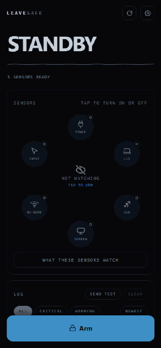

<br/>

**Tap arm → three second countdown → the whole page turns red → someone unplugs the charger → your phone knows.**

*Recorded from a real session: the alert above is a genuine charger-state change read from the operating system, not a mock-up.*

</div>

<br/>

## Set it up in 60 seconds

### 1 · Download it

Use a package manager if you have one — it puts `leavesafe` on your `PATH` and makes upgrading one command:

```bash
brew tap atakankizilyuce/tap
brew install leavesafe
```

```powershell
scoop bucket add atakankizilyuce https://github.com/atakankizilyuce/homebrew-tap
scoop install leavesafe
```

```powershell
winget install LeaveSafe.LeaveSafe
```

Or grab the binary for your machine from the [Releases page](https://github.com/atakankizilyuce/LeaveSafe/releases). One file, no installer, no dependencies.

| Platform | File |
|----------|------|
| Windows 64-bit | `leavesafe-windows-amd64.exe` |
| Linux 64-bit | `leavesafe-linux-amd64` |
| Linux ARM64 | `leavesafe-linux-arm64` |
| macOS Intel | `leavesafe-darwin-amd64` |
| macOS Apple Silicon | `leavesafe-darwin-arm64` |

However you install it, LeaveSafe tells you when a newer release exists — and names the command that upgrades *your* installation. Nothing is ever downloaded or replaced without you.

<details>
<summary><b>macOS: two commands before the first run</b></summary>

<br/>

```bash
chmod +x leavesafe-darwin-arm64
./leavesafe-darwin-arm64
```

Replace `leavesafe-darwin-arm64` with `leavesafe-darwin-amd64` on an Intel Mac.

If macOS says the binary "cannot be opened because the developer cannot be verified", this release was published without a signing certificate. Open **System Settings → Privacy & Security** and click **Open Anyway** next to the LeaveSafe entry.

Older instructions here told you to run `xattr -d com.apple.quarantine`. Do not — and be wary of any security tool that tells you to. That command disarms exactly the check that would catch a tampered download. If you want to confirm a binary is genuine, [verify its provenance](#verifying-a-download) instead.

</details>

<details>
<summary><b>Linux: make it executable</b></summary>

<br/>

```bash
chmod +x leavesafe-linux-amd64
./leavesafe-linux-amd64
```

</details>

<details>
<summary><b>Verifying a download</b></summary>

<br/>

Every release artifact carries a signed attestation naming the workflow and the commit that produced it. This is a stronger claim than a checksum, which only proves a file matches a number published beside it by whoever published both:

```bash
gh attestation verify leavesafe-linux-amd64 --repo atakankizilyuce/LeaveSafe
```

A `.sha256` ships beside each file as well:

```bash
shasum -a 256 -c leavesafe-linux-amd64.sha256
```

A [CycloneDX SBOM](https://cyclonedx.org/) listing every dependency is attached to each release, so you can check what is inside the binary against a vulnerability database without building it yourself.

</details>

<br/>

### 2 · Run it

Double-click it, or run it from a terminal. The dashboard takes over the window: a QR code on the left, live status on the right, the log along the bottom.

<div align="center">
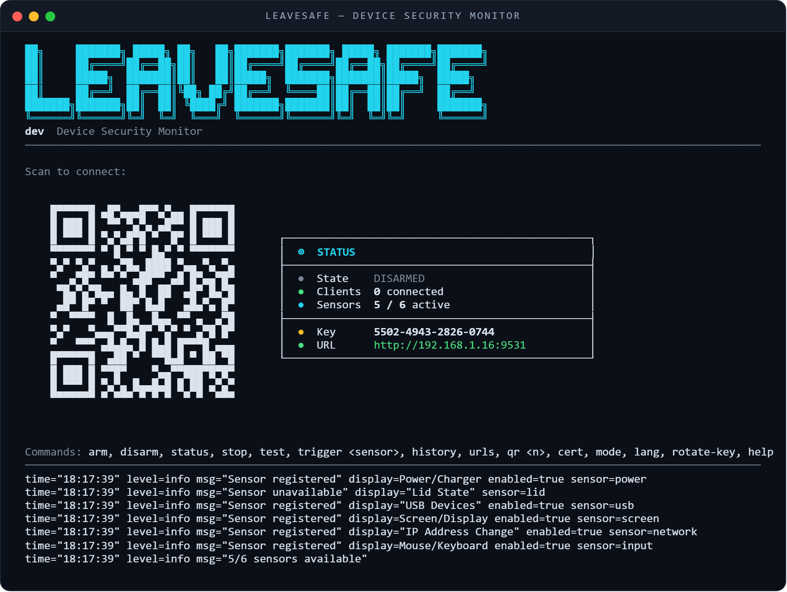
</div>

> **First run only:** LeaveSafe asks whether you want [remote access](#remote-access-over-mobile-data). If you are not sure, answer no — you can turn it on later from the phone, and local pairing works either way.

<br/>

### 3 · Scan it with your phone

Point your phone's camera at the QR code and open the link. No app to install — it is a web page served by your own laptop, and the scan fills the pairing key in for you.

<table>
<tr>
<td width="34%" align="center">
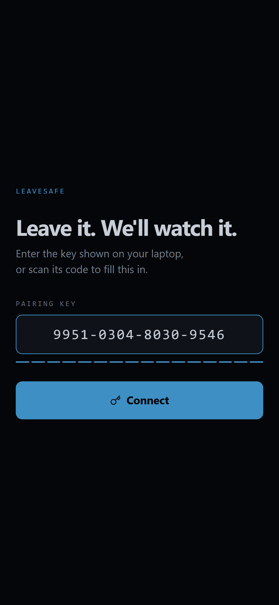
<br/><sub><b>Scanned.</b> The key arrives pre-filled. Typing the 16 digits by hand works too.</sub>
</td>
<td width="33%" align="center">
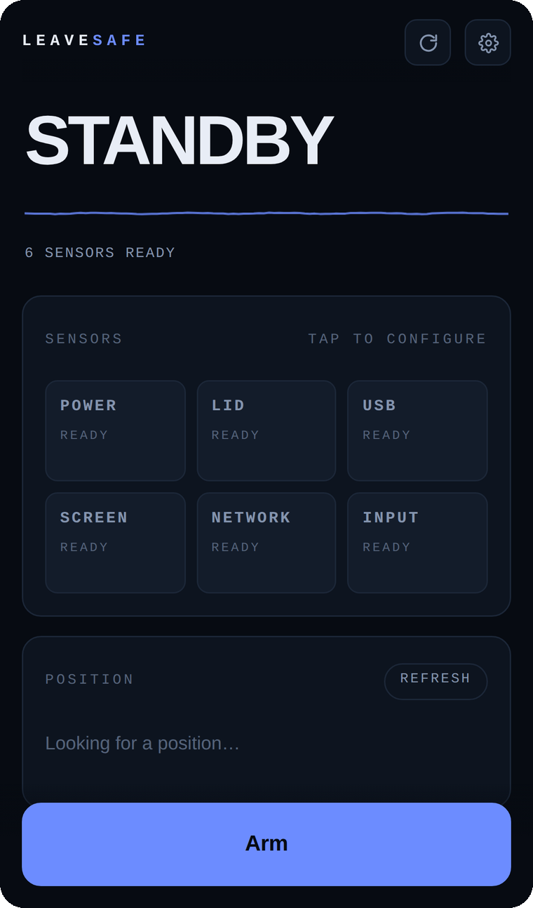
<br/><sub><b>Paired.</b> Six sensors, all ready. Nothing is being watched yet.</sub>
</td>
<td width="33%" align="center">
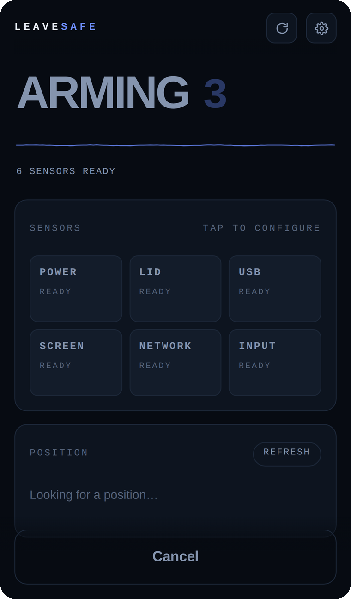
<br/><sub><b>Arming.</b> A three second countdown, so a wrong tap costs you nothing.</sub>
</td>
</tr>
</table>

<br/>

### 4 · Arm it and walk away

Tap **Arm**. The countdown runs, and the entire page turns red — you can read the state from across the room without putting your glasses on.

<table>
<tr>
<td width="34%" align="center">
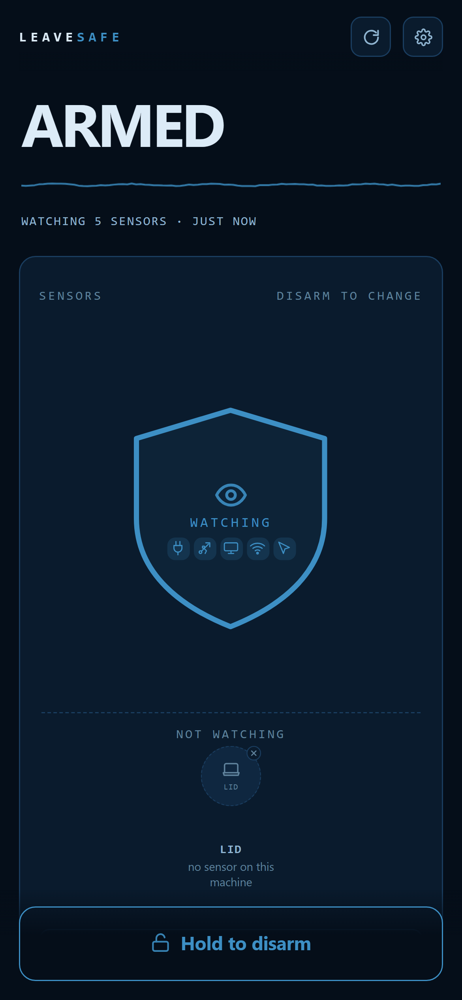
<br/><sub><b>Armed.</b> Everything is red. Six sensors are running on the laptop.</sub>
</td>
<td width="33%" align="center">
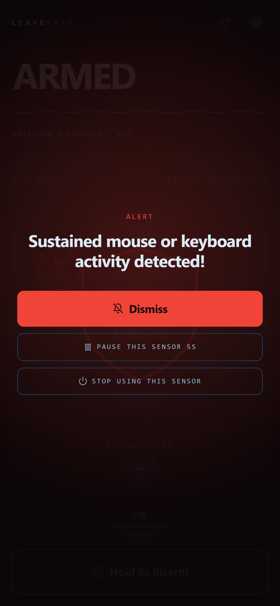
<br/><sub><b>Something happened.</b> Dismiss it, pause that sensor, or switch it off.</sub>
</td>
<td width="33%" align="center">
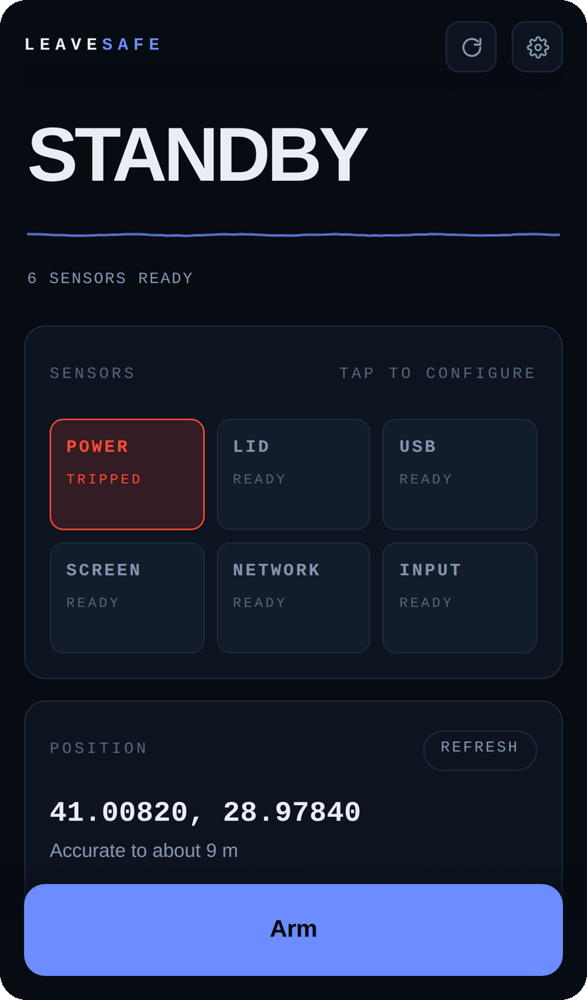
<br/><sub><b>Disarmed.</b> Hold — don't tap — to switch it off. The tile that fired stays lit.</sub>
</td>
</tr>
</table>

**Arming is a tap; disarming is a hold.** Arming by accident costs you nothing — you are standing right there. Disarming by accident silently turns off the thing guarding your laptop, so it asks for a second and a half of deliberate intent.

<br/>

## The interface

### On your phone

The phone screen is built like an aircraft annunciator panel. Tiles sit dark and unremarkable while everything is fine, and become the only thing you can look at when a condition fires.

<table>
<tr>
<td width="34%" align="center">
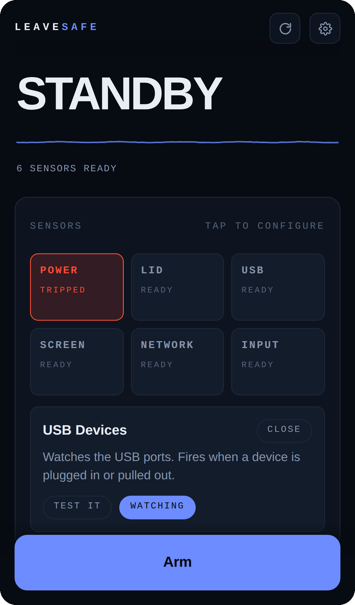
<br/><sub><b>Tap any tile</b> to read what it watches, run a self-test, or switch it off.</sub>
</td>
<td width="33%" align="center">
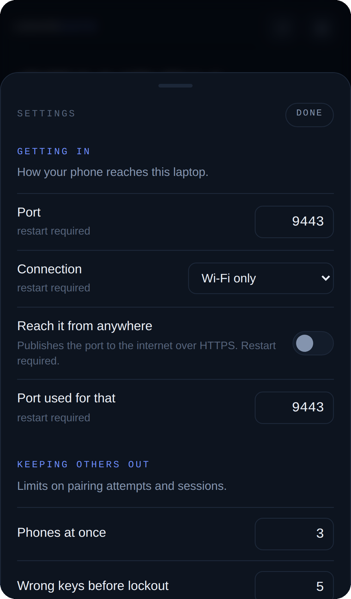
<br/><sub><b>Settings</b> — transport, remote access, session limits, lockout, PIN.</sub>
</td>
<td width="33%" align="center">
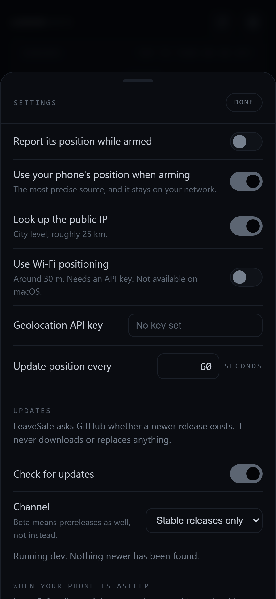
<br/><sub><b>Location</b> — off by default, and it tells you what each source costs.</sub>
</td>
</tr>
</table>

### On your laptop

The terminal dashboard keeps the QR code, live status and the log on one screen. While armed, the state block turns red and every sensor event is written as it happens.

<div align="center">
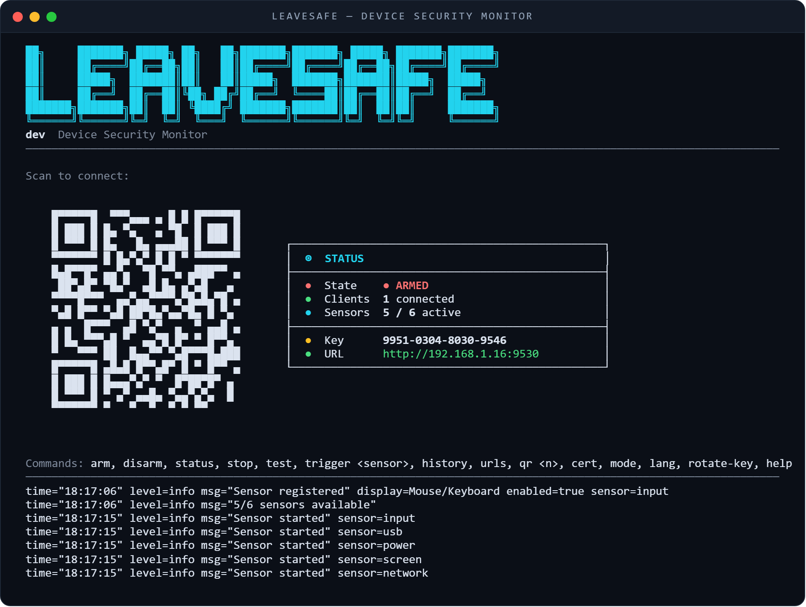
</div>

Type any of these into the dashboard while it runs:

| Command | What it does |
|---------|--------------|
| `test` | Send a test alert to every connected phone |
| `trigger <sensor>` | Fire one sensor by hand (`power`, `lid`, `usb`, `screen`, `network`, `input`) |
| `stop` / `silence` | Stop an alarm that is going off |
| `history` | The last 20 security events |
| `urls` | Every address the server is reachable on; `*` marks the one in the QR code |
| `qr <n>` | Show the QR code for URL `n` from that list |
| `cert` | Print the TLS fingerprint, to compare against your phone's warning |
| `rotate-key` | New pairing key, all sessions invalidated |
| `help` | The list above |
| `Ctrl+C` | Graceful shutdown |

<br/>

## How it works

<div align="center">

</div>

The binary runs three things at once: the sensor monitor that reads the operating system, a WebSocket (and optionally Bluetooth) server your phone connects to, and the terminal dashboard. Nothing else is involved — there is no broker, no relay, no account, and no telemetry.

<details>
<summary><b>The pairing handshake, step by step</b></summary>

<br/>

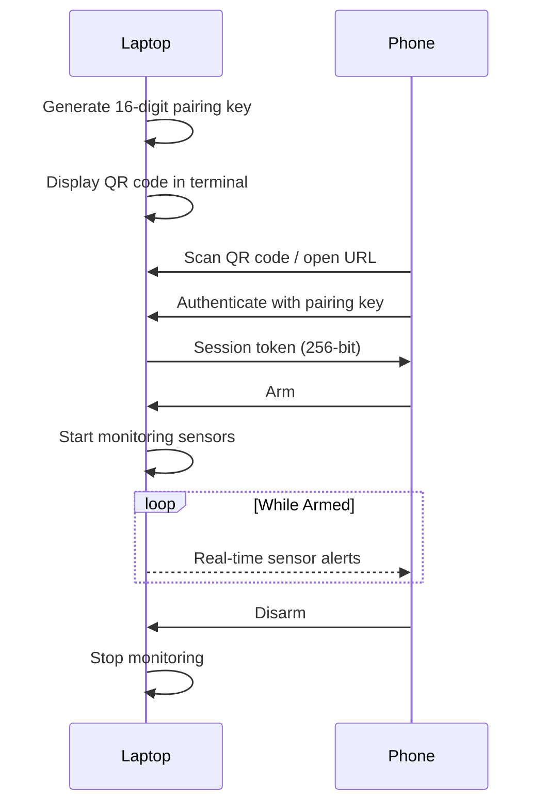
```mermaid
sequenceDiagram
    participant L as Laptop
    participant P as Phone

    L->>L: Generate 16-digit pairing key
    L->>L: Display QR code in terminal
    P->>L: Scan QR code / open URL
    P->>L: Authenticate with pairing key
    L->>P: Session token (256-bit)
    P->>L: Arm
    L->>L: Start monitoring sensors

    loop While Armed
        L-->>P: Real-time sensor alerts
    end

    P->>L: Disarm
    L->>L: Stop monitoring
```

The pairing key is generated fresh on every run and carries a Luhn check digit, so a mistyped digit is rejected before it counts as a failed attempt. Five genuinely wrong keys from the same address trigger a 60-second lockout — counted per source, so a stranger cannot lock you out of your own laptop.

</details>

<details>
<summary><b>What each sensor actually reads</b></summary>

<br/>

| Sensor | What trips it |
|--------|---------------|
| **Power** | The charger is unplugged or plugged in |
| **Lid** | The lid is closed or opened |
| **USB** | A USB device appears or disappears |
| **Screen** | The display turns off or comes back on — what happens when the machine locks |
| **Network** | An interface or its IP address changes |
| **Input** | Sustained keyboard or mouse activity |

Each one is implemented natively per platform — `/sys` and `/proc` on Linux, Win32 calls and PowerShell on Windows, `pmset`, `ioreg` and `system_profiler` on macOS. A sensor that cannot work on your machine reports itself unavailable instead of silently never firing.

</details>

<br/>

## Features

<table>
<tr>
<td width="50%" valign="top">

### Pairing & connection
- **QR code pairing** — Scan once from your phone's browser, no app required
- **Dual transport** — Wi-Fi (WebSocket) or Bluetooth Low Energy
- **No cloud, no accounts** — Your phone connects directly to your laptop, never through a server
- **Mobile data** — Optional remote access over HTTPS for reaching the laptop from another network

### Monitoring
- **Six sensors** — Power, lid, USB, screen lock, network and input
- **Live location** — Optional: see where the machine is while armed, with an honest accuracy radius
- **Auto-arm on screen lock** — Optionally arm the moment you lock the laptop
- **Pause or disable a sensor** — Dismiss an alarm by silencing one sensor for a few seconds, or for good

### Alarm
- **Volume escalation** — Notify the phone first, then half volume, then full
- **Local siren** — An alternating tone plays on the laptop itself
- **Disconnect alarm** — Fires if every phone drops off while armed
- **PIN protection** — Optionally require a PIN to disarm

</td>
<td width="50%" valign="top">

### Security
- **Rate limiting & lockout** — 5 failed attempts from one address means a 60-second lockout
- **Session limit** — At most 3 authenticated phones at a time
- **Sessions that expire** — 256-bit random tokens, with an absolute lifetime and an idle timeout
- **Certificate check at pairing** — The QR code carries the certificate fingerprint; the key is withheld if the server presents a different one
- **scrypt disarm PIN** — Hashed, never stored in cleartext
- **Event audit log** — Every security event recorded as JSONL, size-rotated

### Interface
- **Live terminal dashboard** — QR code, status and log on one screen
- **Mobile web UI** — An annunciator panel: armed and disarmed are different colours, readable across a room
- **Interactive commands** — Test alerts, fire sensors by hand, read history, rotate the key

### Deployment
- **Cross-platform** — Native sensor implementations for Windows, Linux and macOS
- **Single binary** — Nothing to install, nothing to configure to get started
- **Starts when you log in** — `leavesafe install-service`, on all three platforms
- **Survives its own bugs** — A panicking sensor is restarted and reported, not fatal
- **Says when it stopped watching** — A start after a crash or a reboot reports the gap
- **Signed provenance** — Every release artifact attests which workflow and commit built it

</td>
</tr>
</table>

<br/>

## Platform support

| Feature | Windows | Linux | macOS |
|---------|:-------:|:-----:|:-----:|
| Power / charger | ✅ | ✅ | ✅ |
| Lid open / close | ✅ | ✅ | ✅ |
| USB connect / disconnect | ✅ | ✅ | ✅ |
| Screen lock / unlock | ✅ | ✅ | ✅ |
| Network / IP change | ✅ | ✅ | ✅ |
| Input (keyboard/mouse) | ✅ | ✅ | ✅ |
| Bluetooth Low Energy | ✅ | ✅ | ✅ |
| Local alarm siren | ✅ | ✅ | ✅ |

<br/>

## Remote access (over mobile data)

By default LeaveSafe only accepts connections from your local network. **Remote access** publishes the port so your phone can reach the laptop over mobile data or from another network. You are asked which mode you want on first run, and can change it later from the phone's settings screen. Either way it takes a restart.

Understand what you are turning on: remote access makes the port reachable from the internet, and the 16-digit pairing key becomes the only thing between a stranger and your alarm.

### What happens when you enable it

1. A self-signed TLS certificate is generated in the config directory, so the connection is HTTPS and the pairing key is encrypted in transit.
2. A UPnP port mapping is requested from your router and renewed every 30 minutes.
3. The public IP is discovered over STUN, falling back to an HTTPS lookup.
4. The dashboard lists the public URL alongside the local ones.

**If the certificate cannot be created, remote access does not start.** LeaveSafe will not serve an internet-facing port over plain HTTP, because that would put your pairing key on the wire in cleartext. It stays available on the local network and tells you what went wrong.

### The certificate warning

The certificate is self-signed, so your phone will warn you the first time. That warning is expected — and it looks exactly the same as a real interception.

The QR code carries the certificate's fingerprint, so the pairing screen shows you the value to check without walking back to the laptop. Compare it against the one in your browser's warning before accepting. The phone also refuses to send the pairing key at all if the server reports a fingerprint other than the one the code named.

That catches a connection that landed somewhere unintended. It is not proof against a determined interceptor — a browser gives page JavaScript no way to see the certificate of its own connection, so the automatic check is on what the server says about itself. [`SECURITY.md`](SECURITY.md) sets out the limit in full. `cert` in the terminal still prints the fingerprint if you want to check from the other end.

### If your router has no UPnP

UPnP is off by default on many routers. When it fails, LeaveSafe logs the port it needs and keeps running. Forward that TCP port to your laptop manually in your router's admin page, and the public URL works as normal.

### Pairing at home while remote access is on

Scanning the public URL from a phone on the same Wi-Fi requires your router to support NAT hairpinning, and plenty do not. If the QR code will not connect while you are sitting next to the laptop, run `urls` to see the local address and `qr <n>` to show its code instead.

<br/>

## Location

While armed, LeaveSafe can report where the monitored machine is. **This is off by default.** With it off, nothing is scanned and no request leaves the machine. Turn it on in the phone's settings screen.

A laptop has no GPS receiver, so there is no single source of truth. Three are combined, and every position is shown with the source that produced it and an honest accuracy radius:

| Source | Accuracy | Needs | Weakness |
|---|---|---|---|
| **Phone GPS on arm** | 5–10 m | nothing | Records where the laptop *was* when you armed it |
| **Wi-Fi positioning** | 20–50 m | API key, internet | Costs money and involves a third party |
| **IP lookup** | ~25 km | internet | Often points at your ISP rather than at you |

### Why the phone's position counts

When you arm the system, your phone is next to the laptop. Its GPS is therefore the most precise statement available about where the laptop is — for free, with no third party involved. The catch is that it stops being true the moment the laptop is carried off, which is exactly when you care.

So LeaveSafe checks the two against each other. When a live fix lands further from the anchor than both error radii can jointly explain, the two cannot be describing the same place: the anchor is known to be wrong, the live fix wins even though it is less precise, and the phone shows **how far the machine has moved since you armed it**.

A coarse fix never overrules a precise one on its own. An IP lookup 3 km away that admits to 25 km of error is not evidence of anything.

### Wi-Fi positioning

Set a Google Geolocation API key in settings, or point `geolocate_url` at any service implementing the same API. Only the access points' MAC addresses and signal strengths are sent, capped at 24, and never your IP.

### Platform differences

| | Windows | Linux | macOS |
|---|:---:|:---:|:---:|
| Phone GPS on arm | ✅ | ✅ | ✅ |
| IP lookup | ✅ | ✅ | ✅ |
| Wi-Fi positioning | ✅ `netsh` | ✅ `nmcli` / `iw` | ❌ |

**macOS cannot do Wi-Fi positioning, and this will not be fixed here.** Apple does not give access point BSSIDs to an unentitled process: `airport -s` was removed in macOS 14.4, `system_profiler SPAirPortDataType` reports neighboring networks with no BSSID at all, and CoreWLAN requires a Location Services authorization that a single self-contained binary cannot obtain. macOS is served by the phone anchor and the IP lookup.

### The map

The panel shows coordinates, an accuracy radius, the source, and the distance moved — all without touching the network. A map is one tap away and stays opt-in, because loading it fetches tiles from openstreetmap.org.

<br/>

## Start it when you log in

A theft monitor that does not survive a reboot has a hole in it: the machine restarts — a flat battery, an update, someone holding the power button — and comes back watching nothing.

```bash
leavesafe install-service     # start automatically at login
leavesafe service-status      # is it registered, is it running
leavesafe uninstall-service   # stop doing that
```

It registers a systemd user unit on Linux, a LaunchAgent on macOS, and a Scheduled Task on Windows. No administrator rights are needed on any of them, and nothing runs as root — LeaveSafe needs your session to read the screen lock and input state, and has no reason to be more privileged than you.

The background copy runs with `-headless`: no dashboard, no QR code, and its output goes to `leavesafe.log` in the config directory. Since there is no screen to read a fresh key from, **it stores its pairing key** in `pairing.key`, readable only by you. That is what lets your phone reconnect after the restart the whole feature exists to cover. Delete the file to force a new key on the next start.

> **On Linux**, a user unit is torn down at logout and will not start on an unattended boot until you allow lingering: `sudo loginctl enable-linger $USER`. `install-service` prints this.

<br/>

## When it stops watching

LeaveSafe records whether it was armed. If a run ends while armed — a crash, a flat battery, a reboot, or someone closing the window precisely because it was watching them — the next start says so, and when:

```
[!] LeaveSafe was ARMED when it last stopped (armed at 2026-07-28 14:02:11).
    This machine has not been monitored since then.
```

It starts disarmed by default. A freshly booted laptop opens its own lid and accepts its owner's keystrokes, so re-arming automatically would mean screaming at the person who just turned it on. Set `"restore_armed_state": true` if you would rather it re-arm anyway.

A panic in a sensor used to take the whole process down with it. Those loops are supervised now: the failure is logged, written to the event history, shown on the dashboard, and the loop restarts. The rest of the sensors keep watching while it does.

<br/>

## Configuration

Settings are stored in a JSON file and persist across sessions:

| OS | Path |
|----|------|
| Windows | `%APPDATA%\LeaveSafe\config.json` |
| Linux / macOS | `~/.leavesafe/config.json` |

Alongside it: `events.jsonl` (the security event history), `leavesafe.log` (the application log), `state.json` (whether the machine was armed), and `tls/` (the self-signed certificate). Both logs rotate on size and keep a couple of generations, so nothing here grows without bound.

You can change everything from the phone UI, or edit the file directly. A file that does not parse is moved aside as `config.json.corrupt-<timestamp>` rather than silently overwritten, and values that would break the program — a zero heartbeat, a year-long lockout — are clamped with a line in the log saying so.

<details>
<summary><b>All configuration options</b></summary>

<br/>

| Setting | Default | Description |
|---------|---------|-------------|
| `port` | `0` (auto) | HTTP server port |
| `max_sessions` | `3` | Maximum concurrent clients |
| `max_auth_attempts` | `5` | Failed attempts before lockout |
| `lockout_seconds` | `60` | Lockout duration |
| `heartbeat_seconds` | `15` | Status broadcast interval |
| `disconnect_grace_seconds` | `30` | Delay before alarm on full disconnect |
| `auto_arm_on_lock` | `false` | Arm automatically when the screen locks |
| `restore_armed_state` | `false` | Re-arm on startup if the last run ended while armed |
| `session_ttl_minutes` | `1440` | How long a paired session lasts; `0` means forever |
| `session_idle_minutes` | `480` | Drop a session idle this long; `0` means never |
| `update_check` | `true` | Ask GitHub once at startup whether a newer release exists |
| `connection_mode` | `wifi` | Transport mode (`wifi`, `bluetooth`, or `both`) |
| `remote_access` | asked on first run | Publish the port beyond the local network |
| `remote_port` | `9443` | Port used when remote access is enabled |
| `location.enabled` | `false` | Report where this machine is while armed |
| `location.phone_anchor` | `true` | Use the paired phone's position when arming |
| `location.ip_fallback` | `true` | Look up the public IP for a city-level position |
| `location.wifi_enabled` | `false` | Resolve a Wi-Fi scan through a geolocation service |
| `location.geolocate_key` | none | API key for that service; never sent to a client |
| `location.poll_seconds` | `60` | How often to refresh the position while armed |
| `pin_protection.enabled` | `false` | Require a PIN to disarm |
| `alarm.escalation_enabled` | `false` | Enable volume escalation levels |
| `enabled_sensors.*` | varies | Toggle individual sensors on/off |

</details>

<br/>

## Security model

| Layer | Detail |
|-------|--------|
| **Pairing key** | 16 digits with a Luhn check digit, generated fresh each run — or stored owner-only when running headless, which is what lets a phone reconnect after a reboot |
| **Session tokens** | 256-bit random hex strings, never reused, expiring after 24 hours or 8 hours idle |
| **Rate limiting** | 60-second lockout after 5 failed attempts, counted **per source address** so a stranger cannot lock you out |
| **Session limit** | Maximum 3 concurrent connections |
| **Disarm PIN** | Optional, hashed with scrypt, guessed against the same lockout as the pairing key |
| **Disconnect alarm** | Triggers after a 30-second grace period if all clients drop while armed |
| **Transport** | Local network by default. With remote access enabled the port is published to the internet over HTTPS — never plain HTTP |
| **Certificate** | Self-signed, with its fingerprint carried in the QR code so the phone can check which server it reached before sending the key |

All the rate-limiting and session values above are configurable; the defaults are shown. Nothing is uploaded to any server: even in remote access mode the phone talks directly to your laptop.

[`SECURITY.md`](SECURITY.md) sets out what is in scope, what is deliberately not, and how to report a flaw privately. It is worth reading the section on what pairing does and does not prove before you rely on remote access.

<br/>

## Build from source

```bash
# Requires Go 1.25+. Node is NOT required — see below.
git clone https://github.com/atakankizilyuce/LeaveSafe.git
cd LeaveSafe

# Build for your current platform
go build -o leavesafe ./cmd/leavesafe

# Or use the Makefile to build all platforms
make all
```

```bash
./leavesafe          # normal mode
./leavesafe -dev     # development mode (serves web assets from the filesystem)
```

### Working on the phone interface

The interface is a Vite + TypeScript + Preact app in `web/src`, built into `web/dist` and embedded in the binary.

**`web/dist` is committed.** That is deliberate: `go build` and `go install` have to work on a machine that has never installed Node, and a Go project that silently produces a binary with no UI is a bad surprise. The cost of committing a build artifact is that it can drift from its source, so CI rebuilds it and fails if the result differs from what is checked in.

If you change anything under `web/src`, rebuild and commit the output:

```bash
cd web
npm ci
npm run build      # writes web/dist — commit this
npm run typecheck
```

For live reload, run the binary and point Vite's dev server at it. The dev server proxies `/ws` to port 9443:

```bash
go run ./cmd/leavesafe        # terminal one
cd web && npm run dev         # terminal two
```

`./leavesafe -dev` also exists and serves `web/dist` straight from disk, so a rebuild shows up without restarting the binary.

### Development checks

Every pull request has to pass the same gate, and all of it runs locally:

```bash
make fmt         # gofmt
make vet         # go vet
make lint        # golangci-lint (staticcheck, gosec, revive, errcheck, ...)
make web-lint    # biome plus tsc, for web/src
make web-verify  # rebuilds web/dist and fails if the committed output drifted
make vuln        # govulncheck
make test        # unit tests
make check       # all of the above
```

The CI workflow adds a few things a laptop cannot cover on its own:

| Job | What it does |
|-----|--------------|
| `format` | `gofmt` plus a check that `go.mod`/`go.sum` are tidy |
| `typos` | spell check across the repo ([typos](https://github.com/crate-ci/typos), configured in `_typos.toml`) |
| `lint` | `golangci-lint` once per target OS — half this codebase sits behind build tags, so a single platform never sees all of it |
| `test` | unit tests on Linux, Windows and macOS, with coverage reported in the run summary |
| `e2e` | starts the real binary on each OS and drives the whole user flow over a real WebSocket |
| `realtrigger` | fires the hardware changes each runner genuinely permits, and records every one it cannot |
| `sandbox-linux` | boots a real Linux VM under QEMU/KVM and creates real kernel-backed hardware |
| `frontend` | Biome, `tsc`, a production build, and a check that the committed `web/dist` still matches `web/src` |
| `build` | the full five-target release matrix |
| `vulncheck` | `govulncheck` against the Go toolchain and dependencies |

`ci-success` aggregates all of them, so branch protection only needs that one required check. Dependency and action updates arrive weekly through Dependabot.

### How much this proves

Every run publishes a coverage matrix naming each sensor that was genuinely triggered and each one that could not be, with the reason. No test fakes hardware and reports success: where a real trigger is impossible, it is skipped and the gap is stated.

In the Linux VM the charger is genuinely unplugged through the `test_power` kernel module and the real binary reads the change from a real `/sys`. On Windows real pointer activity is synthesised and the input sensor fires; real IP changes are detected on all three. Everything else skips with a measured reason rather than a fake pass — what no CI environment can reach is listed in [docs/manual-verification.md](docs/manual-verification.md).

Run the layers locally with `make test-e2e`, `make test-realtrigger` and `make test-sandbox`; plain `make test` stays fast and touches no hardware.

<br/>

## Contributing

Contributions are welcome. Please open an issue first to discuss what you'd like to change.

1. Fork the repository
2. Create a feature branch (`git checkout -b feature/my-feature`)
3. Commit your changes
4. Open a Pull Request

Run the checks before submitting:

```bash
go test ./... -race     # the fast loop
make check              # what CI runs: format, vet, lint, frontend, vulncheck, tests
```

Two things CI will catch that are easy to forget: if you changed anything under `web/src`, run `npm run build` in `web/` and commit `web/dist` — the binary embeds it, so a stale build ships a UI that does not match its source. And if you changed something a user would notice, add a line to [`CHANGELOG.md`](CHANGELOG.md) under Unreleased.

**Found a security flaw?** Do not open an issue. [`SECURITY.md`](SECURITY.md) has the private reporting route.

<br/>

<div align="center">

## License

Distributed under the [Apache License 2.0](LICENSE).

<br/>

Made with Go

</div>
