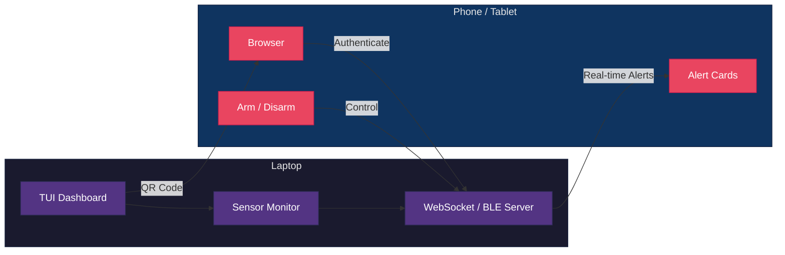
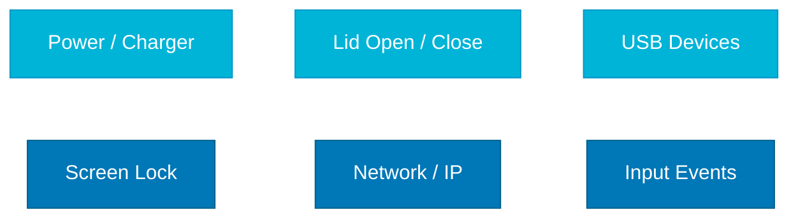
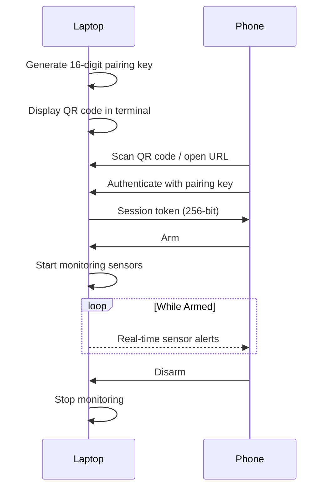

<div align="center">

# LeaveSafe

### Leave your laptop. Stay safe.

A lightweight, cross-platform device security monitor that turns your phone into a remote alarm system — no cloud, no accounts, just a QR code scan.

<br/>

[](https://github.com/atakankizilyuce/LeaveSafe/actions/workflows/ci.yml)
[](https://go.dev)
[](LICENSE)
[](#platform-support)

[](https://github.com/atakankizilyuce/LeaveSafe/actions/workflows/ci.yml)
[](https://github.com/atakankizilyuce/LeaveSafe/actions/workflows/ci.yml)
[](https://github.com/atakankizilyuce/LeaveSafe/actions/workflows/ci.yml)
[](https://github.com/atakankizilyuce/LeaveSafe/actions/workflows/ci.yml)

<br/>

**[Getting Started](#getting-started) | [Features](#features) | [How It Works](#how-it-works) | [Configuration](#configuration)**

</div>

<br/>

## What is LeaveSafe?

LeaveSafe runs on your laptop as a terminal dashboard and lets you **arm a security monitor** from your phone by scanning a QR code. Once armed, it watches the laptop's sensors (charger, lid, USB, screen lock, network, input) and sends instant alerts to your phone if anything changes while you're away.

No internet connection required. Communication runs over WebSocket or Bluetooth Low Energy (BLE), secured with a 16-digit Luhn-validated pairing key. It stays on your local network unless you deliberately turn on [remote access](#remote-access-mobile-data) — and even then, your phone talks straight to your laptop rather than through anyone's server.

<br/>

## Features

<table>
<tr>
<td width="50%" valign="top">

### Pairing & Connection
- **QR Code Pairing** — Scan once from your phone's browser, no app required
- **Dual Transport** — Connect via Wi-Fi (WebSocket) or Bluetooth Low Energy (BLE)
- **No Cloud, No Accounts** — Your phone connects directly to your laptop, never through a server
- **Mobile Data** — Optional remote access over HTTPS for reaching the laptop from another network

### Monitoring
- **Multi-Sensor Monitoring** — Power/charger, lid, USB, screen lock, network, and input changes
- **Live Location** — Optional: see where the machine is while armed, with an honest accuracy radius
- **Auto-Arm on Screen Lock** — Optionally arm automatically when you lock your laptop
- **Sensor Pause / Disable** — Dismiss an alarm by pausing a sensor temporarily or disabling it permanently

### Alarm
- **Volume Escalation** — Configurable levels: notify phone only, medium volume, then full volume
- **Local Siren** — Alternating tone alarm sounds directly on the laptop
- **Graceful Alarm** — Triggers automatically if all clients disconnect while armed
- **PIN Protection** — Optionally require a PIN code to disarm

</td>
<td width="50%" valign="top">

### Security
- **Rate Limiting & Lockout** — 5 failed auth attempts triggers a 60-second lockout
- **Session Management** — Maximum 3 concurrent authenticated clients
- **256-bit Session Tokens** — Random hex tokens, never reused
- **Event Audit Log** — All security events recorded in JSONL format with timestamps

### Interface
- **Live TUI Dashboard** — ASCII terminal UI with QR code, live logs, and system status
- **Mobile Web UI** — Responsive, dark-themed phone interface served directly from the binary
- **Interactive Terminal Commands** — Test alerts, trigger sensors, view history, rotate keys

### Deployment
- **Cross-Platform** — Native sensor implementations for Windows, Linux, and macOS
- **Single Binary** — No dependencies, just download and run
- **Configuration Persistence** — Settings saved in JSON format across sessions

</td>
</tr>
</table>

<br/>

## How It Works


```mermaid
graph LR
    subgraph LAPTOP ["Laptop"]
        TUI["TUI Dashboard"]
        SM["Sensor Monitor"]
        WS["WebSocket / BLE Server"]

        TUI --> SM
        SM --> WS
    end

    subgraph PHONE ["Phone / Tablet"]
        BR["Browser"]
        CTRL["Arm / Disarm"]
        ALERT["Alert Cards"]
    end

    TUI -- "QR Code" --> BR
    BR -- "Authenticate" --> WS
    CTRL -- "Control" --> WS
    WS -- "Real-time Alerts" --> ALERT

    style LAPTOP fill:#1a1a2e,stroke:#16213e,color:#e6e6e6
    style PHONE fill:#0f3460,stroke:#16213e,color:#e6e6e6
    style TUI fill:#533483,stroke:#2c2c54,color:#fff
    style SM fill:#533483,stroke:#2c2c54,color:#fff
    style WS fill:#533483,stroke:#2c2c54,color:#fff
    style BR fill:#e94560,stroke:#c81d4e,color:#fff
    style CTRL fill:#e94560,stroke:#c81d4e,color:#fff
    style ALERT fill:#e94560,stroke:#c81d4e,color:#fff
```

<br/>

<div align="center">

### Sensors


```mermaid
graph LR
    P["Power / Charger"] ~~~ L["Lid Open / Close"] ~~~ U["USB Devices"]
    S["Screen Lock"] ~~~ N["Network / IP"] ~~~ I["Input Events"]

    style P fill:#00b4d8,stroke:#0096c7,color:#fff
    style L fill:#00b4d8,stroke:#0096c7,color:#fff
    style U fill:#00b4d8,stroke:#0096c7,color:#fff
    style S fill:#0077b6,stroke:#005f8a,color:#fff
    style N fill:#0077b6,stroke:#005f8a,color:#fff
    style I fill:#0077b6,stroke:#005f8a,color:#fff
```

</div>

<br/>

### Pairing Flow


```mermaid
sequenceDiagram
    participant L as Laptop
    participant P as Phone

    L->>L: Generate 16-digit pairing key
    L->>L: Display QR code in terminal
    P->>L: Scan QR code / open URL
    P->>L: Authenticate with pairing key
    L->>P: Session token (256-bit)
    P->>L: Arm
    L->>L: Start monitoring sensors

    loop While Armed
        L-->>P: Real-time sensor alerts
    end

    P->>L: Disarm
    L->>L: Stop monitoring
```

<br/>

## Getting Started

### Download Binary

Grab the latest pre-built binary from the [Releases page](https://github.com/atakankizilyuce/LeaveSafe/releases).

| Platform | File |
|----------|------|
| Windows 64-bit | `leavesafe-windows-amd64.exe` |
| Linux 64-bit | `leavesafe-linux-amd64` |
| macOS Intel | `leavesafe-darwin-amd64` |
| macOS Apple Silicon | `leavesafe-darwin-arm64` |

#### macOS: First-time setup

macOS blocks unsigned binaries by default. After downloading, run these commands in Terminal to make it executable:

```bash
# 1. Grant execute permission
chmod +x leavesafe-darwin-arm64

# 2. Remove the quarantine attribute added by macOS Gatekeeper
xattr -d com.apple.quarantine leavesafe-darwin-arm64

# 3. Run it
./leavesafe-darwin-arm64
```

> **Note:** Replace `leavesafe-darwin-arm64` with `leavesafe-darwin-amd64` if you are on an Intel Mac.

If you still see a "cannot be opened" warning, go to **System Settings > Privacy & Security** and click **Open Anyway** next to the LeaveSafe entry.

### Build from Source

```bash
# Requires Go 1.25+
git clone https://github.com/atakankizilyuce/LeaveSafe.git
cd LeaveSafe

# Build for your current platform
go build -o leavesafe ./cmd/leavesafe

# Or use the Makefile to build all platforms
make all
```

### Development Checks

Every pull request has to pass the same gate, and all of it runs locally:

```bash
make fmt        # gofmt
make vet        # go vet
make lint       # golangci-lint (staticcheck, gosec, revive, errcheck, ...)
make web-lint   # biome, for web/*.js
make vuln       # govulncheck
make test       # unit tests
make check      # all of the above
```

The CI workflow adds a few things a laptop cannot cover on its own:

| Job | What it does |
|-----|--------------|
| `format` | `gofmt` plus a check that `go.mod`/`go.sum` are tidy |
| `typos` | spell check across the repo ([typos](https://github.com/crate-ci/typos), configured in `_typos.toml`) |
| `lint` | `golangci-lint` once per target OS — half this codebase sits behind build tags, so a single platform never sees all of it |
| `test` | unit tests on Linux, Windows and macOS, with coverage reported in the run summary |
| `e2e` | starts the real binary on each OS and drives the whole user flow over a real WebSocket |
| `realtrigger` | fires the hardware changes each runner genuinely permits, and records every one it cannot |
| `sandbox-linux` | boots a real Linux VM under QEMU/KVM and creates real kernel-backed hardware |
| `frontend` | Biome lint and format check on the embedded web client |
| `build` | the full five-target release matrix |
| `vulncheck` | `govulncheck` against the Go toolchain and dependencies |

`ci-success` aggregates all of them, so branch protection only needs that one required check. Dependency and action updates arrive weekly through Dependabot.

### How much this proves

Every run publishes a coverage matrix naming each sensor that was genuinely triggered and each one that could not be, with the reason. No test fakes hardware and reports success: where a real trigger is impossible, it is skipped and the gap is stated.

In the Linux VM the charger is genuinely unplugged through the `test_power` kernel module and the real binary reads the change from a real `/sys`. On Windows real pointer activity is synthesised and the input sensor fires; real IP changes are detected on all three. Everything else skips with a measured reason rather than a fake pass — what no CI environment can reach is listed in [docs/manual-verification.md](docs/manual-verification.md).

Run the layers locally with `make test-e2e`, `make test-realtrigger` and `make test-sandbox`; plain `make test` stays fast and touches no hardware.

<br/>

## Usage

```bash
./leavesafe          # normal mode
./leavesafe -dev     # development mode (serves web assets from filesystem)
```

The terminal dashboard opens with:
- A **QR code** on the left — scan it with your phone
- A **status panel** on the right showing armed state, connected clients, active sensors, and the pairing key
- A **live log** area at the bottom

### Terminal Commands

| Command | Description |
|---------|-------------|
| `test` | Send a test alert to all connected clients |
| `trigger <sensor>` | Manually trigger a specific sensor (`power`, `lid`, `usb`, `screen`, `network`, `input`) |
| `stop` / `silence` | Stop an active alarm |
| `history` | Show the last 20 security events |
| `urls` | List every URL the server is reachable on; `*` marks the one in the QR code |
| `qr <n>` | Show the QR code for URL `n` from that list |
| `cert` | Print the TLS certificate fingerprint to compare against your phone's warning |
| `rotate-key` | Generate a new pairing key and invalidate all sessions |
| `help` | Show available commands |
| `Ctrl+C` | Graceful shutdown |

**On your phone:** Open the URL shown in the terminal (or scan the QR code), authenticate, and use the **Arm** / **Disarm** buttons. You can also enable/disable individual sensors and configure alarm settings from the phone UI.

<br/>

## Remote Access (mobile data)

By default LeaveSafe only accepts connections from your local network. **Remote
access** publishes the port so your phone can reach the laptop over mobile data
or from another network. You are asked which mode you want on first run, and can
change it later from the phone's settings screen. Either way it takes a restart.

Understand what you are turning on: remote access makes the port reachable from
the internet, and the 16-digit pairing key becomes the only thing between a
stranger and your alarm.

### What happens when you enable it

1. A self-signed TLS certificate is generated in the config directory, so the
   connection is HTTPS and the pairing key is encrypted in transit.
2. A UPnP port mapping is requested from your router and renewed every 30 minutes.
3. The public IP is discovered over STUN, falling back to HTTPS lookup.
4. The dashboard lists the public URL alongside the local ones.

**If the certificate cannot be created, remote access does not start.** LeaveSafe
will not serve an internet-facing port over plain HTTP, because that would put
your pairing key on the wire in cleartext. It stays available on the local
network and tells you what went wrong.

### The certificate warning

The certificate is self-signed, so your phone will warn you the first time. That
warning is expected — but it looks exactly the same as a real interception. Run
`cert` in the terminal and compare the fingerprint with the one your browser
shows before you accept it.

### If your router has no UPnP

UPnP is off by default on many routers. When it fails, LeaveSafe logs the port it
needs and keeps running. Forward that TCP port to your laptop manually in your
router's admin page, and the public URL works as normal.

### Pairing at home while remote access is on

Scanning the public URL from a phone on the same Wi-Fi requires your router to
support NAT hairpinning, and plenty do not. If the QR code will not connect while
you are sitting next to the laptop, run `urls` to see the local address and
`qr <n>` to show its code instead.

<br/>

## Location

While armed, LeaveSafe can report where the monitored machine is. **This is off
by default.** With it off, nothing is scanned and no request leaves the machine.
Turn it on in the phone's settings screen.

A laptop has no GPS receiver, so there is no single source of truth. Three are
combined, and every position is shown with the source that produced it and an
honest accuracy radius:

| Source | Accuracy | Needs | Weakness |
|---|---|---|---|
| **Phone GPS on arm** | 5–10 m | nothing | Records where the laptop *was* when you armed it |
| **Wi-Fi positioning** | 20–50 m | API key, internet | Costs money and involves a third party |
| **IP lookup** | ~25 km | internet | Often points at your ISP rather than at you |

### Why the phone's position counts

When you arm the system, your phone is next to the laptop. Its GPS is therefore
the most precise statement available about where the laptop is — for free, with
no third party involved. The catch is that it stops being true the moment the
laptop is carried off, which is exactly when you care.

So LeaveSafe checks the two against each other. When a live fix lands further
from the anchor than both error radii can jointly explain, the two cannot be
describing the same place: the anchor is known to be wrong, the live fix wins
even though it is less precise, and the phone shows **how far the machine has
moved since you armed it**.

A coarse fix never overrules a precise one on its own. An IP lookup 3 km away
that admits to 25 km of error is not evidence of anything.

### Wi-Fi positioning

Set a Google Geolocation API key in settings, or point `geolocate_url` at any
service implementing the same API. Only the access points' MAC addresses and
signal strengths are sent, capped at 24, and never your IP.

### Platform differences

| | Windows | Linux | macOS |
|---|:---:|:---:|:---:|
| Phone GPS on arm | ✅ | ✅ | ✅ |
| IP lookup | ✅ | ✅ | ✅ |
| Wi-Fi positioning | ✅ `netsh` | ✅ `nmcli` / `iw` | ❌ |

**macOS cannot do Wi-Fi positioning, and this will not be fixed here.** Apple
does not give access point BSSIDs to an unentitled process: `airport -s` was
removed in macOS 14.4, `system_profiler SPAirPortDataType` reports neighboring
networks with no BSSID at all, and CoreWLAN requires a Location Services
authorization that a single self-contained binary cannot obtain. macOS is served
by the phone anchor and the IP lookup.

### The map

The panel shows coordinates, an accuracy radius, the source, and the distance
moved — all without touching the network. A map is one tap away and stays
opt-in, because loading it fetches tiles from openstreetmap.org.

<br/>

## Platform Support

| Feature | Windows | Linux | macOS |
|---------|:-------:|:-----:|:-----:|
| Power / Charger | ✅ | ✅ | ✅ |
| Lid open / close | ✅ | ✅ | ✅ |
| USB connect / disconnect | ✅ | ✅ | ✅ |
| Screen lock / unlock | ✅ | ✅ | ✅ |
| Network / IP change | ✅ | ✅ | ✅ |
| Input (keyboard/mouse) | ✅ | ✅ | ✅ |
| Bluetooth Low Energy | ✅ | ✅ | ✅ |
| Local alarm siren | ✅ | ✅ | ✅ |

<br/>

## Configuration

Settings are stored in a JSON file and persist across sessions:

| OS | Path |
|----|------|
| Windows | `%APPDATA%\LeaveSafe\config.json` |
| Linux / macOS | `~/.leavesafe/config.json` |

You can change settings from the phone UI or by editing the file directly.

<details>
<summary><b>All configuration options</b></summary>

<br/>

| Setting | Default | Description |
|---------|---------|-------------|
| `port` | `0` (auto) | HTTP server port |
| `max_sessions` | `3` | Maximum concurrent clients |
| `max_auth_attempts` | `5` | Failed attempts before lockout |
| `lockout_seconds` | `60` | Lockout duration |
| `heartbeat_seconds` | `15` | Status broadcast interval |
| `disconnect_grace_seconds` | `30` | Delay before alarm on full disconnect |
| `auto_arm_on_lock` | `false` | Arm automatically when screen locks |
| `connection_mode` | `wifi` | Transport mode (`wifi`, `bluetooth`, or `both`) |
| `remote_access` | asked on first run | Publish the port beyond the local network |
| `remote_port` | `9443` | Port used when remote access is enabled |
| `location.enabled` | `false` | Report where this machine is while armed |
| `location.phone_anchor` | `true` | Use the paired phone's position when arming |
| `location.ip_fallback` | `true` | Look up the public IP for a city-level position |
| `location.wifi_enabled` | `false` | Resolve a Wi-Fi scan through a geolocation service |
| `location.geolocate_key` | none | API key for that service; never sent to a client |
| `location.poll_seconds` | `60` | How often to refresh the position while armed |
| `pin_protection.enabled` | `false` | Require PIN to disarm |
| `alarm.escalation_enabled` | `false` | Enable volume escalation levels |
| `enabled_sensors.*` | varies | Toggle individual sensors on/off |

</details>

<br/>

## Security Model

| Layer | Detail |
|-------|--------|
| **Pairing Key** | 16 digits with Luhn check digit, generated fresh each run |
| **Session Tokens** | 256-bit random hex strings, never reused |
| **Rate Limiting** | 60-second lockout after 5 failed attempts, counted **per source address** so a stranger cannot lock you out |
| **Session Limit** | Maximum 3 concurrent connections |
| **Disconnect Alarm** | Triggers after 30-second grace period if all clients drop while armed |
| **Transport** | Local network by default. With remote access enabled the port is published to the internet over HTTPS — never plain HTTP |

All four rate-limiting and session values above are configurable; the defaults
are shown. Nothing is uploaded to any server: even in remote access mode the
phone talks directly to your laptop.

<br/>

## Contributing

Contributions are welcome. Please open an issue first to discuss what you'd like to change.

1. Fork the repository
2. Create a feature branch (`git checkout -b feature/my-feature`)
3. Commit your changes
4. Open a Pull Request

Run tests before submitting:

```bash
go test ./... -v -race
```

<br/>

<div align="center">

## License

Distributed under the [Apache License 2.0](LICENSE).

<br/>

Made with Go

</div>
